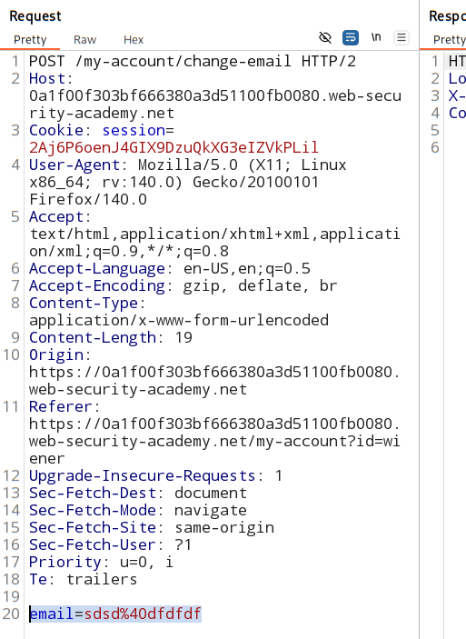
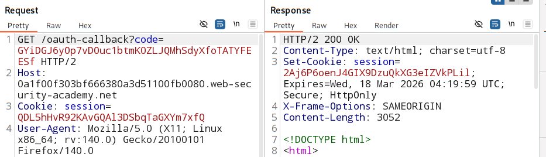

# SameSite Lax bypass via cookie refresh

### [Refer lab](https://portswigger.net/web-security/learning-paths/csrf/csrf-bypassing-samesite-lax-restrictions-with-newly-issued-cookies/csrf/bypassing-samesite-restrictions/lab-samesite-strict-bypass-via-cookie-refresh#)

### Goal:
Change the email address using CSRF attack.

### vulnerable parameter:
change email function vulnerbale to CSRF.

### remember:

- 2 min window provided non-top level POST request only when:
    1. deafult 'Lax` restriction
    2. not for manually configured `sameSite=Lax`

### Analysis:

1. check the oAuth response for any `sameSite` attribute in set-cookie.

No `sameSite` restriction when setting cookie. 

browser will use deafult restriction - `Lax` (offers 2 min window after login / setting cookie for SSO)

### Attempt CSRF attack:

1. #### Trigger manual login method:

if oauth authentication happended in less then 120 seconds - **[this script](./directCSRFattack.html)** works.

- if you logged in less than two minutes ago, the attack is successful and your email address is changed. 

- From the `Proxy > HTTP history` tab, find the `POST /my-account/change-email` request and confirm that your session cookie was included even though this is a cross-site POST request. 

2. #### No manual login trigger + refresh session cookie:

- if you visit `/social-login`, this automatically initiates the full OAuth flow

- If you have a logged-in session with the OAuth server, this all happens without any interaction. 

- new session cookie is set - even if you are already logged in 

- [New script ](./cookieRefresh.html) for cookie refresh first, then CSRF attack

- the initial request **gets blocked** by the browser's popup blocker. 

    - the CSRF attack is still launched. However, this is only successful if it has been less than two minutes since your cookie was set. 

    - If not, the attack fails because the popup blocker prevents the forced cookie refresh. 

3. #### Bypass popup blocker

- need **manual user intergation** for the cookie change trigger
