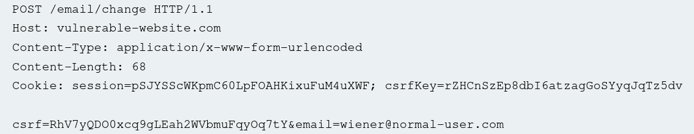
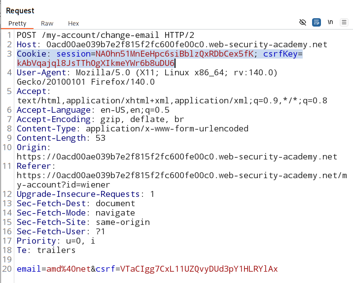
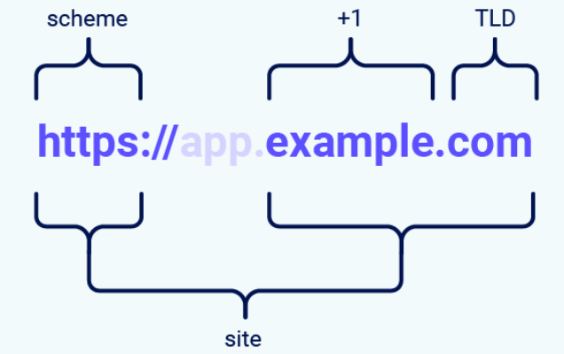
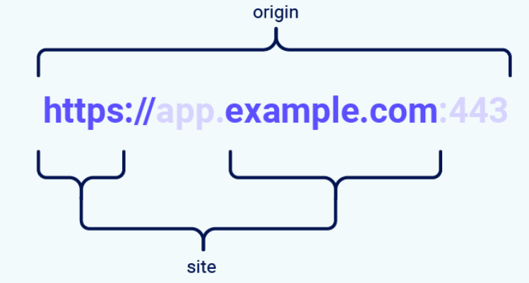

# CSRF (Cross Site Request Forgery) vulnerability

image credit - [Rana Khalil](https://www.youtube.com/@RanaKhalil101)

## What is CSRF?
Is a web-security vulnerability that allow an attacker to induce users to perform an action that they do not intend to perform.

Attacker partially circumvent **same origin policy**.
- ***one website cant access data of other website.*** 
- partial circumvent means:
    - attacker cant access/read data.
    - attacker can request to modify data.

- CSRF breach trust of the browser. 

## cookies: 
simply a text file that contains some information that identifies the user to the backend

**many application uses cookies that contains users PII.**
- username 
- roles of the user in the application - access privilage
- etc etc


This cookie identify the user for all future requests.

### How cookie work in the backend:


1. user accesses a domain he has accessed before.
2. brower check the `cookie jar`
3. if cookie exist for same domain - browser send it with the `get request`.
4. domain's backend check which user is assigned to this cookie
5. application check for level of access to the user.
6. and give access to the resources.


#### important pre-requisite:  
user has to be already logged in to the application. 

## Steps to CSRF attack:

**1. attacker send the victim a malicious link/ script that will conduct the CSRF attack.**


    sent a phising link - will change the users email address registerd on the bank website.

**2. if user is authenticated - has a cookie in the cookies jar for `bank website` , attacker can change the email** 


**3. attack now has direct access to the users account.**


## CSRF conditons:
for a webiste to be tagged as vulnerable to CSRF:

1. **A relevent action** - an expolit that will cause detrimental effect to the victim.  
    example - logout functionality / change language functionality - it not serious enough. Hence not CSRF vulnerable.

2. **Cookie based session handling** - CSRF is depend on the default functionality of the browser to send cookies with the requests.

3. **No unpredictable request parameters** - attacke must be able to predict the URL parameter. 
    - example- `https://bank.com/email/chnage?email=attacker@gmail.com`
    - the paramete (email) here is predictable 

    hence to defend from CSRF attack - **`CSRF token`** is added with the request parameter.  
    CSRF token are added with the request parameter each time and it is unpredictable. 

## How to find CSRF vulnerabilty:

### Prespective:

- **Black box testing** -   
    Tester is given:
    - URL of the application
    - Credentials for each access level of the app

- **White Box Testing** - 
    Tester is given: (more visibility)
    - URL
    - creds
    - source code 

### Black Box prespective:

#### 1. Map the app

- review all the key functionality in the app

#### 2. Identify which of the functionality satisfy the condition:
- relevent actions
- cookie-based session handling
- no unpredictable request parameters

#### 3. create a PoC (Proof of Concept) script to the exploit CSRF
- `GET` request : `` tag with `src` attribute set to vulnerbale URL.
    
- `POST` request : `form` elements with hidden fields for all required parameters and the target set to vulnerable URL

### White Box prespective:

#### 1. identify the framework that is being used by the application 
- read the code
- modern frameworks have build in defences for CSRF vulnerability 

#### 2. findout how the frame work defence againt CSRF attacks

#### 3. review the code to ensure the built in defenses have not been disabled 
- devs do this while integreting their app with other app
 
#### 4. review each and every functionality to ensure that the CSRF defense has been applied 
- some times dev intoduce custom code etc

## How to Exploit CSRF vulnerabilty:

**For majority of application there are 2 scenarios:**

### 1. `GET` request scenario:

You shoud NOT use `GET` method in oder to submit Data to app - Intoduces potential attack vectors.
1. GET request can be triggered acidentally.
2. GET parameters are visbile in the URL.
3. GET request can be cached.
4. Makes CSRF attacks easier.  
    ``````

If a state-changing action uses GET, CSRF becomes extremely easy

victim should click on an malicious application, that will run a script containing this request:

``` 
GET https://bank.com/email/change?email=test@test.ca HTTP/1.1 
```

#### Expolit:

```
<html>
    <body> 
        <h1> hello world! </h1>
        
    </body>
</html>
```
1. victim click on the link.

2. The malicious app loads

3. Browser visit ` src` URL   

4. the broswer look for cookie for the `bank.com` domain.

5. cookie found - user authenticated cookie.

6. cookie gets attached with the request and is sent 

7. email id is changed.

### 2. `POST` request scenario:

``` 
POST /email/change HTTP/1.1
Host: https://bank.com
...
email - test@test.ca
```

#### Exploit script:
```
<html>
    <body>
        <h1>Hello world</h1>
        <iframe style="dispay:none" "name="csrf-iframe></iframe>
        <form action="https://bank.com/email/change/" method="POST" target="csrf-iframe" id="csrf-form">
            <input type="hidden" name="email" value="test@test.ca">
        </form>

        <script>document.getElementById("csrf-form").submit()</script>
    </body>
</html>
```

##### `<form>` has `target` :

tells where will the form's response opens after submition.`(window/tab/frame)`  

Used to tell the form to run within an ***invisible iframe*** element.  

When the user click on the webiste (malicious), he is not redirected to email change functionality of `bank.com`

### Automated Exploitation tools:
Web Application Vulnerability Scanners(WAVS)
1. Burp suite pro
2. arachni
3. wapiti
4. acunetix
5. w3af

### How to prevent CSRF vulnerability:

1. **Primary Defences:**  

    Use CSRF token in relevant requests.  

    CSRF token: 
    - randomly generated long string.

    - passed along with request as a parameter

    - tied to user session. ***why?***

        - if it is ***not*** tied to a users session, the attacker can create its own account in the targeted app 
        - generate a CSRF token for his account 
        - use it in place for users's CSRF parameter in the request 
        - It will be an successful request. coz target app backend wont check the session's CSRF.
    - validated before the relevent action is executed.

    #### How CSRF token is transmitted?
    1. ***hidden field of an HTML `form`*** that is submitted using `POST` method and CSRF token is passed in the parameter.

        

    2. Custom request header - not used as much

    3. Token submitted in the URL query string (as parameters) - less secure way.

    4. tokens transmitted within cookies. - never do it 

    #### How CSRF token is validated?
    1. generated and stored server-side

    2. when performing a request, a validation should be performed - verify submitted token = stored token in the user's session.

    3. validation should be performed for all type of HTTP methods (GET, POST etc)

    4. token not submitted - request rejected and log it. 

2. **Additional Defences:**  

    use of sameSite cookies.

    It is a broswer security mechanism. 

    When will a `website's cookie` be sent with a request origining from other websites

    the `sameSite` attribute is added to `set-cookie` response header when a server issue a cookie, typically during login or session initialization.

    Used to control whether cookies are submitted in cross-site requests.  

    ```
    Set-Cookie: session=test; SameSite=strict
    Set-Cookie: session=test; SameSite=Lax // chrome's default
    Set-Cookie: flavor=choco; SameSite=None; Secure
    ```

3. **Inadequate defences:** (can be bypassed but are used in real life scenario)  

    use of `referer` header by some appilications.

    `referer` HTTP request header - contains an absolute or partial address of the page making the requests.

    > tracks where the request came from 

    This is generally **less effective than CSRF token** validation. 

    #### why it is used?
    the application usually check the if,
    > **referer header = domain of the application**
    
    if equal, accept the request
    else, reject the request

    not the best way to deal with CSRF attacks.
    1. Referer header can be `spoofed`
    2. defense can be bypassed
        - example #1 - if it is not present - the application dont check for it.
        - example #2 - referer header is only checked to see if it contains the domain and exact match is not made.  
        if you include domain of the app as query parameter in a URL
            > www.malsite.com/?bank.com

### Test CSRF token:

1. remove `CSRF token` from `POST` request paramter and check if app is still working.

2. change request method from `POST` to `GET` and check if app is still working.

### Common flaws in CSRF token validation:
CSRF vulnerabilities typically arise due to flawed validation of CSRF tokens.

1. **Validation of CSRF dependent on Request method**  
    ([refer lab](./tokenValidationReqMethod/lab.md))

    - application skip the validation when the `GET` method is used.  
    - correctly validate token for `POST` method.
    
    Hence attacker can use `GET` method to bypass the CSRF token validation while attacking

    


2. **Validation of CSRF token depends on token being present**  
    ([refer lab](./tokenPresentValidation/lab.md))

    - if token is present - apps validate the token
    - but when it is **not present - some apps skip** it

    attacker can exploit this, by removing the entire CSRF parameter from the request. 


3. **CSRF token is not tied to the user session**  
    ([refer lab](./tokenNotTiedToASession/sessionCheck.md))

    - some applications do not validate that the token belongs to the same session as the user who is making the request.

    - the app maintain a global pool of CSRF token that it has issued.
    
    - app accepts any token that appears in the pool.

    attacker can abuse this by:  
    - logging into the app using his own account 
    - obtain a valid token
    - feed that token to the victim user account.

    This happens coz of improper implementation of CSRF token by the devs.

4. **CSRF token is tied to a non-session cookie**  
    ([refer lab](./CSRFtokenTiedNonSessionCookie/analysis.md))

     

    - **harder to exploit.**  
    
    - some application tie the CSRF token to a wrong cookie (**not** a cookie that track session).

    - happens when applicaiton employs 2 diff framework
        1. for session handling
        2. for CSRF protection.  

        and not integreted together.

        

        #### if `session` and `csrfkey`(being used to manage the CSRF token) is not tied to eachother - functionality is vulnerable to CSRF attack.


    #### How to perform?
    
    1. attacker set a cookie in a viticm's browser

    2. attacker log in to the application using own account

    3. obtain a valid token and associated cookie

    4. leverage the cookie-setting behavior to place their cookie into the victim's browser

    5. feed their token to the victim in their CSRF attack. 

    ```
    note-
        Even if the vulnerable application itself does not allow cookie manipulation, another subdomain in the same DNS domain might allow setting cookies that will also be sent to the vulnerable application, enabling CSRF attacks.   

        Victim browser
                │
                ▼
    staging.demo.normal-website.com
        (attacker sets cookie)
                │
                ▼
    Cookie stored for normal-website.com
                │
                ▼
    Victim visits secure.normal-website.com
                │
                ▼
    Browser sends attacker-controlled cookie
    ```

5. **CSRF token is simply duplicated in a cookie**  
    ([refer lab](./CSRFTokenDupilcatedCookie/analysis.md))

    - some applications do not maintain any server-side record of tokens that have been issued
    
    - instead they duplicate each token within a cookie and a request parameter.
    
    - way to validate?
        > **CSRF token in cookie = CSRF token in the request parameter** 

    - Aka **`DOUBLE SUBMIT`** defence against CSRF

    - it used coz:
        - simple to implement
        - require no server side state 

    - used in stateless applications - apps that dont store any session state in the backend

    #### How attack is perfomed in this situation?
    
    1. check if website contain any ***cookie setting functionality***

    2. no need for a valid token of attackers own

    3. inject random CSRF token in:
        - request parameter and
        - cookie (by  HTML header injection) - this place the token on vicitms browser.

## Bypassing `SameSite` cookie restrictions:

### <u>background</u>:

- In the context of SameSite cookie restrictions, a site is defined as:
    - the top-level domain (TLD), eg- `.com` or `.in`
    - \+ 1 additional level of domain `TLD+1`

- When determining whether a request is same-site or not, the **URL scheme is also taken into consideration**.
    - eg:
        ```
        https://example.com  
        http://example.com
        ```
        not sameSite | cross-site

        

    > **note :**   
    "effective top-level domain" (eTLD) - reserved
    multipart suffiexs that are treated as top level domain.  
    eg- `.co.in`

#### What's the difference between a site and an origin?

- `Site` encompasses ***multiple domain-names***

    - A Site is based only on the **registrable domain (eTLD+1)**.

    - Ignores subdomain

        

- `Origin` ***only includes one domain name***.

    - origin defined by 3 things:
        
        1. **Scheme** -> `https`, `http`
        2. **domain(host)** -> `example.com`
        3. **Port** -> `80`, `443` , etc

            >  scheme + host + port

    Feature | Origin | Site   
    -------- | -------- | ------ 
    Protocol / scheme | considered | ✅ Yes | ❌ No
    Port considered | ✅ Yes | ❌ No
    Subdomain considered| ✅ Yes | ❌ No
    Strictness| Very strict | Less strict

    

    #### examples:

    Request from |	Request to |	Same-site? |	Same-origin?
    ------- | ------- | ---- | -----
    https://example.com | https://example.com |	**Yes** | **Yes**  
    https://app.example.com | https://intranet.example.com | **Yes** |No: mismatched domain name
    <mark>https://example.com</mark> | <mark>https://example.com:8080</mark> | <mark>**Yes**</mark> | <mark>No: mismatched port</mark>
    https://example.com | https://example.co.uk | No: mismatched eTLD | No: mismatched domain name
    https://example.com | http://example.com | No: mismatched scheme | No: mismatched scheme 

    ### <mark>A cross-origin request can still be same-site, but not the other way around.</mark>

    - Where it is used?

    - if you find a vulnerabilty in a domain of a site ( eg - `XSS attack`)

    - you can access / send request to other domain of same site.  

    #### Before `SameSite` defence mechanism :

- Any third party website could trigger a request on a site and browser used to send the cookie for the site with the request.

- exposed sites to `CSRF attack`

### 3 restriction level of SameSite:

1. Strict
2. Lax  // default - if dev dont specify any restriction level for a cookie
3. none

> **Set-Cookie: session=0F8tgdOhi9ynR1M9wa3ODa; SameSite=Strict**

#### 1. SameSite = Strict:

- No cookie is allowed in cross site requests.

- checks `address bar site` and `requested site`
    - if same - pass 
    - else failed - cross-site decteted.

- Can degrade user experience. 

    - example:
        - you are in login into `facebook.com`
        - now you open google brower and search facebook.com and clicked on facebook.com
        - browser will see:
            - address bar - `google.com`
            - requested url - `facebook.com`
        - broswer wont send cookie.
        - user cant access his stored session. 
        - relogin required. 

#### 2. SameSite = Lax:

- Cookies are allowed to be included in a cross-site request if and only if:
    - It's a `GET` request.
    - Request resulted from a top-level navigation by the user, such as <mark>clicking on a link</mark>. 

- The cookie is not included in background requests, such as:
    - those initiated by scripts,
    - iframes,
    - or references to images ``
    - and other resources. 

#### 3. SameSite = None:

- Browers send cookie in all type of requests (same-site, cross-site).

- When setting a cookie with `SameSite=None`, the website must also include the `Secure` attribute, which ensures that the cookie is only sent in <mark>encrypted messages over HTTPS</mark>.  Otherwise, browsers will reject the cookie and it won't be set.

    > **Set-Cookie: trackingId=0F8tgdOhi9ynR1M9wa3ODa; SameSite=None; Secure**


### Bypassing SameSite `Lax` restrictions using `GET` requests

- server dont care of `GET` or `POST` method for requests.

- Even for `form` submission  any method can be used.

- `CSRF attack` is possible here.

    - just change the request method from `POST` to `GET` on victim's browser and brower will send the request.

- as it is `Lax` restriction - top level navigation (like click of button) is must.

```
<script>
    document.location = 'https://vulnerable-website.com/account/transfer-payment?recipient=hacker&amount=1000000';
</script>
```
- in the above example - it is a `form` submission if you see the url but it is being done by `GET` method.

- **<u>If ordinary `GET` is not allowed</u> :**
    - some frameworks provide way to override the method used in the request.
    - example - <mark>Symfony</mark> support `_method` paramter in form.
    ```
    <form action="https://vulnerable-website.com/account/transfer-payment" method="POST">
        <input type="hidden" name="_method" value="GET">
        <input type="hidden" name="recipient" value="hacker">
        <input type="hidden" name="amount" value="1000000">
    </form>
    ```

    > GET /my-account/change-email?email=test1@tester.ca&**_method=POST** HTTP/1.1

### Bypassing SameSite `Strict` restriction using `on-site gadget`

- cookie -> SameSite=Strict -> no cross-site request allowed.

- can be bypassed -> use on-site gadget

- **Gadget** - any feature / functionalilty of the viticm's site that can be used by attacker to trigger a request
    
    - example:
        - open redirect (client-side redirect - dynamically constructs the redirection target using attacker-controllable input like URL parameters.)
        - vulnerable Javascript
        - DOM-based redirect
        - auto-form submit

#### How to use `on-site gadget` in an attack works:

- The on-site gadget here is - (redirect gadget)
    > https://bank.com/redirect?next=URL

- JS behind this code is -
    > document.location = new URLSearchParams(location.search).get("next");

#### Failed attempt:
- user login into the `bank.com` wesbite 
    - cookie sent to the broswer 
        > session=abc123; **SameSite=Strict**

- Victim visits user website:
    > evil.com
    - site triggers:  
        ``

- this is cross-site, no cookie will be passed - failed attack.

#### Successful attack:
- <u>use of gadget</u>.

- victim open attacker site
    > evil.com 

- site triggers:
    > https://bank.com/redirect?next=/transfer?amount=1000

    - step 1:
        - the brower vists `bank.com/redirect`
        - cross-site
        - cookie not sent with the request.
    
    - step 2:
        - `bank.com` javascript runs
            > document.location = "/transfer?amount=1000"
        - broswer redirects
            > bank.com/transfer?amount=1000

        - same-site 
        - cookie sent.

- server receives:
    > GET /transfer?amount=1000 Cookie: session=abc123

- attack successful.

#### Note that the equivalent attack is <mark>not possible with server-side redirects.</mark> 
- this case, browsers recognize that the request to follow the redirect resulted from a cross-site request initially, so they still apply the appropriate cookie restrictions. 

### Bypassing `sameSite` restriction via vulnerable sibling domain:

**<mark>A request can still be same-site even if it's issued cross-origin.</mark>**

- audit all of the available attack surface, including any sibling domains.

- In particular, vulnerabilities that enable you to elicit an arbitrary secondary request, such as `XSS`.
    - can compromise site-based defenses completely
    - expose all of the site's domains to cross-site attacks. 

- if the target website supports **WebSockets**:
    - **cross-site WebSocket hijacking (CSWSH)**
        - which is just a CSRF attack targeting a WebSocket handshake. 

### Bypassing `SameSite` `Lax` restrictions with newly issued cookies

- When `sameSite = Lax` for a cookie included - the cookie is not sent in `non-top-level POST`  request.

- exceptions...

- if `sameSite` restriction is set by default - which is `lax`:
    - to avoid breaking <mark>single sign-on (SSO)</mark> mechanisms, it doesn't actually enforce these restrictions for the first <mark>120 seconds</mark> on top-level POST requests.

    - **2 min window for cross-site attack.(like CSRF)**

```
Note: 
    This two-minute window does not apply to cookies that were explicitly set with the SameSite=Lax attribute.
```

- **SSO** - user login once on an application and gets to access multiple other applicaiton without login.  

- ### somewhat impractical to time the attack.
    - hence <mark>refresh the cookies</mark>.

    - if attacker force the vicitm to issue new session cookie, then window will reset.

    - **the core idea in this type of attack is to force user to relogin which will open the 2 min window.**

    - use `gadget` on the victim's site to trigger user relogin.
        - OAuth login endpoint
        - auto login redirect
        - silent authentication

    #### Attack flow:

    ```
    Victim → attacker site
          ↓
    trigger OAuth login
            ↓
    site issues NEW session cookie
            ↓
    <120 seconds window>
            ↓
    attacker sends POST CSRF request
            ↓
    cookie included
            ↓
    attack successful
    ```

#### Tigger cookie refresh without manual login:

- To trigger the cookie refresh without the victim having to manually login again, you need to use a `top-level navigation`.
    - ensures cookies associated with their current OAuth session are included.

#### You dont want victim to exit/redirect attacker's page:

- Why?

- attacker need to run the CSRF attack after new cookie is suppiled.

- #### Solution?

    ```
    evil.com
        ↓
    redirect to SSO
        ↓
    SSO login complete
        ↓
    redirect back to evil.com
        ↓
    CSRF attack
    ```
    - But this 'redirect back' depends if victim site allow redirect or not.

- #### better solution?

    - open new tab for victim login

    > window.open('https://vulnerable-website.com/login/sso');

    - Tab 1 → attacker site
    - Tab 2 → OAuth login

- #### Problem: Popup blockers

    - modern browser automatically blocks popups.

    > window.open('https://vulnerable-website.com/login/sso');

    - as no user interaction - popup will be blocked 

    - if event trigger by `user clicks` - popup allowed

        ```
        window.onclick = () => {
        window.open('https://vulnerable-website.com/login/sso');
        }
        ```
    ### Final attack flow:

    ```
    Victim visits evil.com
            ↓
    User clicks anywhere
            ↓
    JS opens new tab → site.com/login/sso
            ↓
    OAuth login completes
            ↓
    New session cookie issued
            ↓
    <120 sec SameSite window>
            ↓
    evil.com launches CSRF POST request
            ↓
    Browser sends fresh cookie
            ↓
    Attack successful
    ````
 
## Bypassing Referer-based CSRF defenses

- Aside from defenses that employ CSRF tokens,

- Some applications make use of the `HTTP Referer header` to attempt to defend against CSRF attacks.

- By verifying that the request originated from the application's own domain.

- **less effective approch**

### The Referer header is an HTTP request header that tells the server which page the request came from.

- It contains the URL of the page that initiated the request.

- example:

    - user is on: 
        > https://example.com/profile

    - user click on link:
        > https://bank.com/transfer
    
    - broswer send request:
        > GET /transfer HTTP/1.1  
        Host: bank.com  
        Referer: https://example.com/profile

    - Browsers usually add this header when:
        - Clicking a link
        - Submitting a form
        - Loading images
        - Loading scripts
        - AJAX requests
        - Redirects

    - Browsers or pages may **hide** or **modify** the Referer for privacy.
        - method includes:

            1. **referrer policy** :

                > Referrer-Policy: no-referrer

            2. **HTTPS → HTTP downgrade** :
            
                > https://site.com → http://othersite.com
                
                - browser often **removes referer** to avoid leaking secure URLs

            3. **HTML attribute**

                - Developers can disable referer in links:

                    >  \<a href="https://site.com" rel="noreferrer">

            4. **JavaScript / redirects**

                - Certain redirects or scripts can change it.
        
- Referer header **cannot be trusted** because:
    - It can be missing 
    - It can be manipulated 
    - Attackers can forge requests

- Example using tools like:

    - Burp Suite
    - Postman

### Validation of Referer depends on header being present

- some application validate referer header when it is present in the HTTP request header 

- else skip if it is ommited from the header.

    ### Attack:

    - use `META` tag with HTML page that host the CSRF attack

    > \<meta name="referrer" content="never">