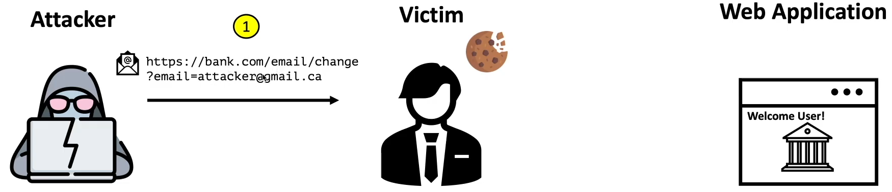
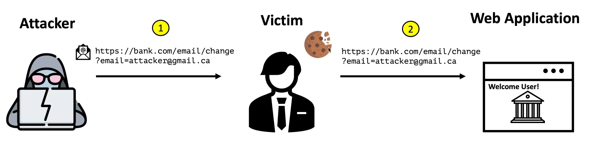
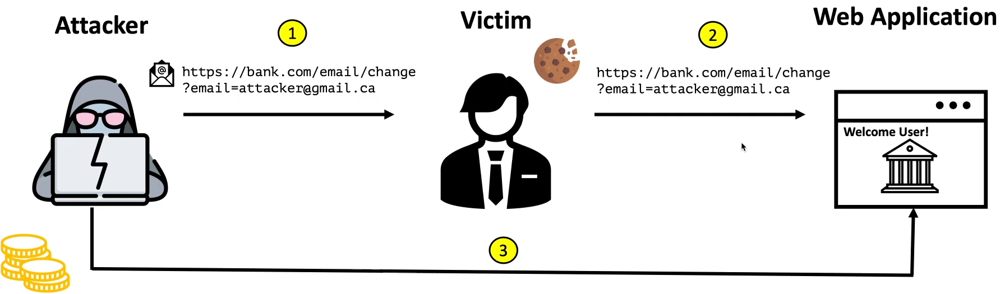
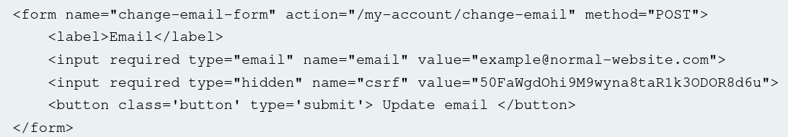
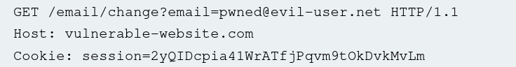

# CSRF (Cross Site Request Forgery) vulnerability

image credit - [Rana Khalil](https://www.youtube.com/@RanaKhalil101)

## What is CSRF?
Is a web-security vulnerability that allow an attacker to induce users to perform an action that they do not intend to perform.

Attacker partially circumvent **same origin policy**.
- ***one website cant access data of other website.*** 
- partial circumvent means:
    - attacker cant access/read data.
    - attacker can request to modify data.

- CSRF breach trust of the browser. 

## cookies: 
simply a text file that contains some information that identifies the user to the backend

**many application uses cookies that contains users PII.**
- username 
- roles of the user in the application - access privilage
- etc etc


This cookie identify the user for all future requests.

### How cookie work in the backend:


1. user accesses a domain he has accessed before.
2. brower check the `cookie jar`
3. if cookie exist for same domain - browser send it with the `get request`.
4. domain's backend check which user is assigned to this cookie
5. application check for level of access to the user.
6. and give access to the resources.


#### important pre-requisite:  
user has to be already logged in to the application. 

## Steps to CSRF attack:

**1. attacker send the victim a malicious link/ script that will conduct the CSRF attack.**


    sent a phising link - will change the users email address registerd on the bank website.

**2. if user is authenticated - has a cookie in the cookies jar for `bank website` , attacker can change the email** 



**3. attack now has direct access to the users account.**



## CSRF conditons:
for a webiste to be tagged as vulnerable to CSRF:

1. **A relevent action** - an expolit that will cause detrimental effect to the victim.  
    example - logout functionality / change language functionality - it not serious enough. Hence not CSRF vulnerable.

2. **Cookie based session handling** - CSRF is depend on the default functionality of the browser to send cookies with the requests.

3. **No unpredictable request parameters** - attacke must be able to predict the URL parameter. 
    - example- `https://bank.com/email/chnage?email=attacker@gmail.com`
    - the paramete (email) here is predictable 

    hence to defend from CSRF attack - **`CSRF token`** is added with the request parameter.  
    CSRF token are added with the request parameter each time and it is unpredictable. 

## How to find CSRF vulnerabilty:

### Prespective:

- **Black box testing** -   
    Tester is given:
    - URL of the application
    - Credentials for each access level of the app

- **White Box Testing** - 
    Tester is given: (more visibility)
    - URL
    - creds
    - source code 

### Black Box prespective:

#### 1. Map the app

- review all the key functionality in the app

#### 2. Identify which of the functionality satisfy the condition:
- relevent actions
- cookie-based session handling
- no unpredictable request parameters

#### 3. create a PoC (Proof of Concept) script to the exploit CSRF
- `GET` request : `` tag with `src` attribute set to vulnerbale URL.
    
- `POST` request : `form` elements with hidden fields for all required parameters and the target set to vulnerable URL

### White Box prespective:

#### 1. identify the framework that is being used by the application 
- read the code
- modern frameworks have build in defences for CSRF vulnerability 

#### 2. findout how the frame work defence againt CSRF attacks

#### 3. review the code to ensure the built in defenses have not been disabled 
- devs do this while integreting their app with other app
 
#### 4. review each and every functionality to ensure that the CSRF defense has been applied 
- some times dev intoduce custom code etc

## How to Exploit CSRF vulnerabilty:

**For majority of application there are 2 scenarios:**

### 1. `GET` request scenario:

You shoud NOT use `GET` method in oder to submit Data to app - Intoduces potential attack vectors.
1. GET request can be triggered acidentally.
2. GET parameters are visbile in the URL.
3. GET request can be cached.
4. Makes CSRF attacks easier.  
    ``````

If a state-changing action uses GET, CSRF becomes extremely easy

victim should click on an malicious application, that will run a script containing this request:

``` 
GET https://bank.com/email/change?email=test@test.ca HTTP/1.1 
```

#### Expolit:

```
<html>
    <body> 
        <h1> hello world! </h1>
        
    </body>
</html>
```
1. victim click on the link.

2. The malicious app loads

3. Browser visit ` src` URL   

4. the broswer look for cookie for the `bank.com` domain.

5. cookie found - user authenticated cookie.

6. cookie gets attached with the request and is sent 

7. email id is changed.

### 2. `POST` request scenario:

``` 
POST /email/change HTTP/1.1
Host: https://bank.com
...
email - test@test.ca
```

#### Exploit script:
```
<html>
    <body>
        <h1>Hello world</h1>
        <iframe style="dispay:none" "name="csrf-iframe></iframe>
        <form action="https://bank.com/email/change/" method="POST" target="csrf-iframe" id="csrf-form">
            <input type="hidden" name="email" value="test@test.ca">
        </form>

        <script>document.getElementById("csrf-form").submit()</script>
    </body>
</html>
```

##### `<form>` has `target` :

tells where will the form's response opens after submition.`(window/tab/frame)`  

Used to tell the form to run within an ***invisible iframe*** element.  

When the user click on the webiste (malicious), he is not redirected to email change functionality of `bank.com`

### Automated Exploitation tools:
Web Application Vulnerability Scanners(WAVS)
1. Burp suite pro
2. arachni
3. wapiti
4. acunetix
5. w3af

### How to prevent CSRF vulnerability:

1. **Primary Defences:**  

    Use CSRF token in relevant requests.  

    CSRF token: 
    - randomly generated long string.

    - passed along with request as a parameter

    - tied to user session. ***why?***

        - if it is ***not*** tied to a users session, the attacker can create its own account in the targeted app 
        - generate a CSRF token for his account 
        - use it in place for users's CSRF parameter in the request 
        - It will be an successful request. coz target app backend wont check the session's CSRF.
    - validated before the relevent action is executed.

    #### How CSRF token is transmitted?
    1. ***hidden field of an HTML `form`*** that is submitted using `POST` method and CSRF token is passed in the parameter.

        

    2. Custom request header - not used as much

    3. Token submitted in the URL query string (as parameters) - less secure way.

    4. tokens transmitted within cookies. - never do it 

    #### How CSRF token is validated?
    1. generated and stored server-side

    2. when performing a request, a validation should be performed - verify submitted token = stored token in the user's session.

    3. validation should be performed for all type of HTTP methods (GET, POST etc)

    4. token not submitted - request rejected and log it. 

2. **Additional Defences:**  

    use of sameSite cookies.

    It is a broswer security mechanism. 

    When will a `website's cookie` be sent with a request origining from other websites

    the `sameSite` attribute is added to `set-cookie` response header when a server issue a cookie, typically during login or session initialization.

    Used to control whether cookies are submitted in cross-site requests.  

    ```
    Set-Cookie: session=test; SameSite=strict
    Set-Cookie: session=test; SameSite=Lax
    Set-Cookie: flavor=choco; SameSite=None; Secure
    ```

3. **Inadequate defences:** (can be bypassed but are used in real life scenario)  

    use of `referer` header by some appilications.

    `referer` HTTP request header - contains an absolute or partial address of the page making the requests.

    > tracks where the request came from 

    This is generally **less effective than CSRF token** validation. 

    #### why it is used?
    the application usually check the if,
    > referer header = domain of the application
    
    if equal, accept the request
    else, reject the request

    not the best way to deal with CSRF attacks.
    1. Referer header can be `spoofed`
    2. defense can be bypassed
        - example #1 - if it is not present - the application dont check for it.
        - example #2 - referer header is only checked to see if it contains the domain and exact match is not made.  
        if you include domain of the app as query parameter in a URL
            > www.malsite.com/?bank.com

### Test CSRF token:

1. remove `CSRF token` from `POST` request paramter and check if app is still working.

2. change request method from `POST` to `GET` and check if app is still working.

### Common flaws in CSRF token validation:
CSRF vulnerabilities typically arise due to flawed validation of CSRF tokens.

1. Validation of CSRF dependent on **Request method**  
    ([refer lab](./tokenValidationReqMethod/lab.md))

    - application skip the validation when the `GET` method is used.  
    - correctly validate token for `POST` method.
    
    Hence attacker can use `GET` method to bypass the CSRF token validation while attacking

    

2. Validation of CSRF token depends on token being present  
    ([refer lab](./tokenPresentValidation/lab.md))

    - if token is present - apps validate the token
    - but when it is **not present - some apps skip** it

    attacker can exploit this, by removing the entire CSRF parameter from the request. 