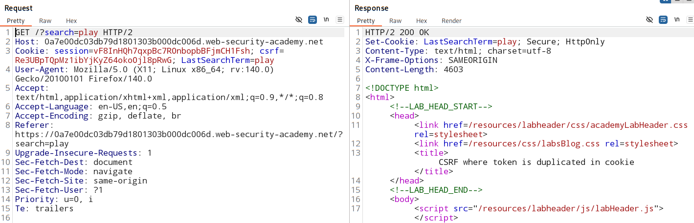

# Double Submit CSRF defence

Insecure method to validate CSRF.

### Vulnerable parameter:
Email change functionality

### Analysis:

#### Check if email change functionality is probe to CSRF:

1. **Relevent action** ? -> YES 
    - email change - later change the password

2. **cookie-based session handling?** -> YES

3. **presence of unpredictable parameter?** -> YES
    - But...
    - 

#### ~~Testing CSRF token~~ : 
**(not to be tested when CSRF token and CSRF cookie both is present)**

1. remove the CSRF token from the request parameter and check if app accepts the request.

2. Change the request method from `POST` to `GET`

3. check if the CSRF token is tied to user session.

#### Test CSRF token and CSRF cookie: 
**(tested when CSRF token and CSRF cookie both is present)**

1. ~~Check if CSRF token is tied to CSRF cookie~~ :  
(if CSRF token value != CSRF cookie value, then test this ) 
    
    - submit an invalid token
    
    - submit a valid token from another user

        If above both request is rejected by the application, this mean **CSRF token is tied to CSRF cookie** 
    
    - submit a valid token and CSRF cookie from another user session 
        - if this submits, **CSRF token and user session is not tied together**

2. **If CSRF parameter value = CSRF cookie value** - it is `DOUBLE SUBMIT` defence:
    - what this does is:
        - CSRF cookie and CSRF parameter are sent to the backend 
        - and backend check if both are same or not.

### Exploit double submit vulnerabilty

1. inject a CSRFkey cookie in the user's session (HTTP header injection)
    - how to do this?
    - find a parameter that can mainipulate cookie setting 

    