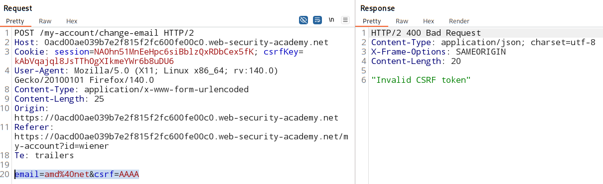
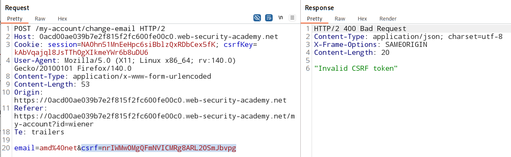
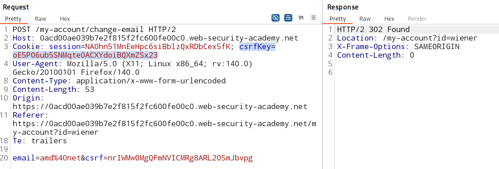

# CSRF token is tied to non-session cookie

### Vulnerable parameter:
email change functionality 

### Goal:

### Analysis:

#### Is CSRF attack is possible in the vulnerable parameter?

1. A relevent action is performed? -> YES
2. cookie-based session handling? -> YES
3. no unpredictable request parameter? -> NO
    - there is CSRF token present 
    - but...
    - it can be bypassed.
    
#### Testing CSRF tokens and CSRF cookies: 
1. Check if CSRF token is tied to CSRF cookie:

    - submit an invalid CSRF token and see if app accepts it

        

    - submit a valid CSRF token taken from a different user.

        

        this means that the CSRF token is tied to CSRF cookie (`CSRFkey`)
    
2. Check if CSRF token and CSRF cookie is tied to session: 

    - Submit valid CSRF token and CSRF cookie from another user.

        

        This means the session handing framework and CSRF handing framework isnt tied together.  

#### Attacker will perform 2 things to exploit this vulnerabilty:

1. Inject CSRFkey cookie in the victims session (HTTP header injection)

    - find any functionalilty that dynamically form the header by user input 

    - do header injection here for CSRFkey cookie
        > %0d%0a = CRLF (newline in HTTP headers)

2. send a CSRF attack to the victim with a known CSRF token

#### Attack Script
[click here](./csrfNonSessionTie.html)