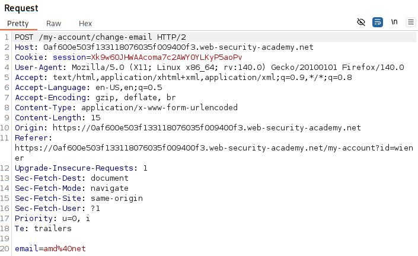

# CSRF vulnerability with no defence

### [vulneable website link](https://portswigger.net/web-security/learning-paths/csrf/csrf-how-to-construct-a-csrf-attack/csrf/lab-no-defenses#)

### vulnerable parameter:
email change functionality

### actions:
#### exploit the CSRF vulerability
1. built an HTML page using CSRF attack - change the email-address
2. Upload it to ur exploit server

### credentials: 
wiener:peter

### Analysis

#### Is email change prone to CSRF attack?

#### 1. Do email change functionailty has a relevant action ? -> YES

- Can change the users name and later change the password and have the control of the victims account.

#### 2. cookie based session handling ? -> YES

#### 3. no unpredectable request parameter ? -> none

YES the change email functionality is vulnerable to CSRF.

### PoC script:
[Click here]()

### How the script runs ?
1. spun up an python server on local host. (directory same as script directory)
    > python -m SimpleHTTPserver 5555

    or
    
    >  python3 -m http.server 5555
    
    this will host the script on the server.
2. Host the script on the attackers website
3. when the victim access the attackers website, script runs automatically in the broweser of the user 