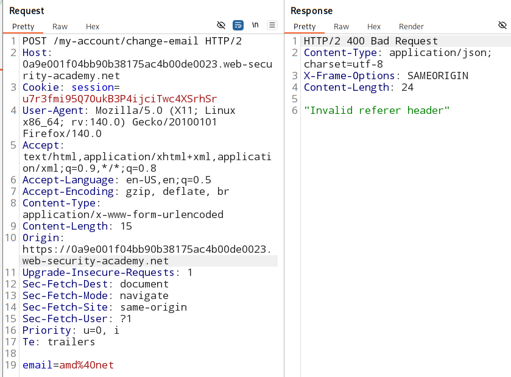
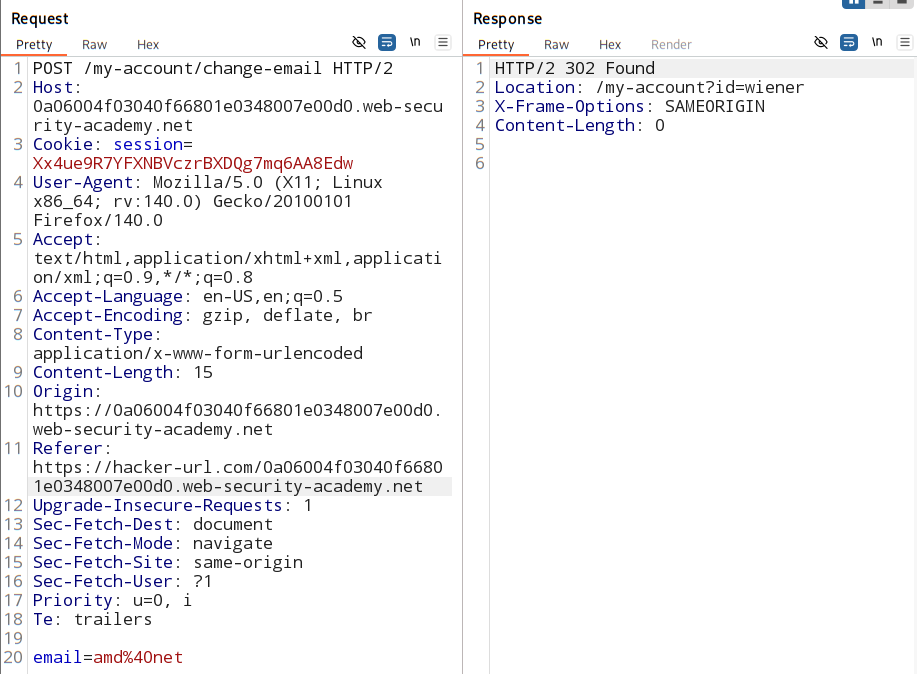

# CSRF with broken referer validation:

### [vulnerable lab](https://portswigger.net/web-security/learning-paths/csrf/csrf-validation-of-referer-can-be-circumvented/csrf/bypassing-referer-based-defenses/lab-referer-validation-broken)

### vulnerable parameter:

- Email change functionality is vulnerable to CSRF

### Goal: 

- perfom CSRF attack on the vulnerable parameter and change the email id.

### Analysis:

#### Test the Referer header:

1. remove the referer header from the email change HTTP request and see the resonse 

    

2. Check which portion of the referer header is the application validating.

    

    - this app is only checking if the Referer **contains** the domain.

    - not **prefix check**

### Use `history API` :

- The History API allows JavaScript to:

    - modify browser history
    - change the URL
    - navigate forward/back programmatically

- without refreshing the page.

#### `history,pushState()`

Example:

- Suppose the current page is:
    > https://example.com/profile

- JS runs:
    > history.pushState({}, "", "/settings");

- new URL becomes:
    > https://example.com/settings

#### use in the attack:

```
<script>history.pushState('','','/?vicitm-site')</script>
```