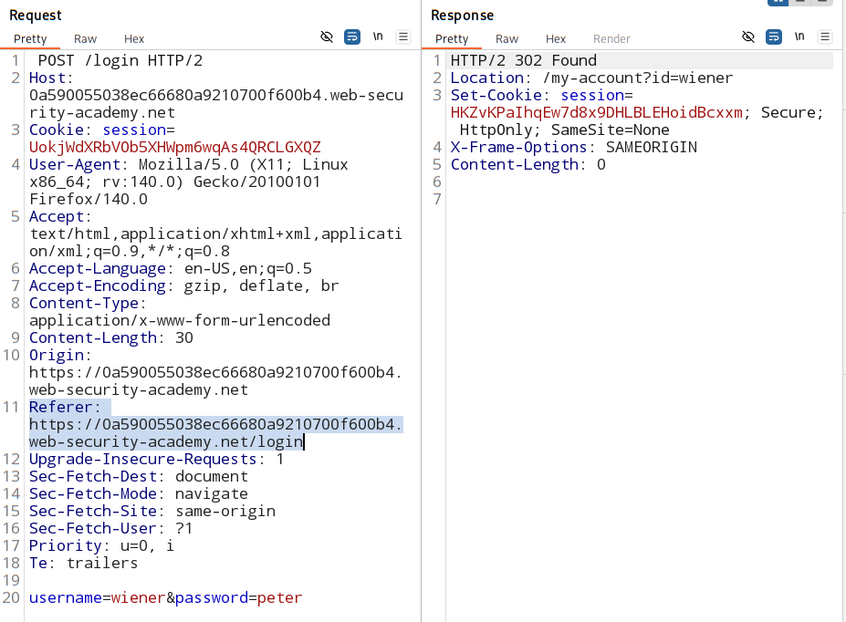
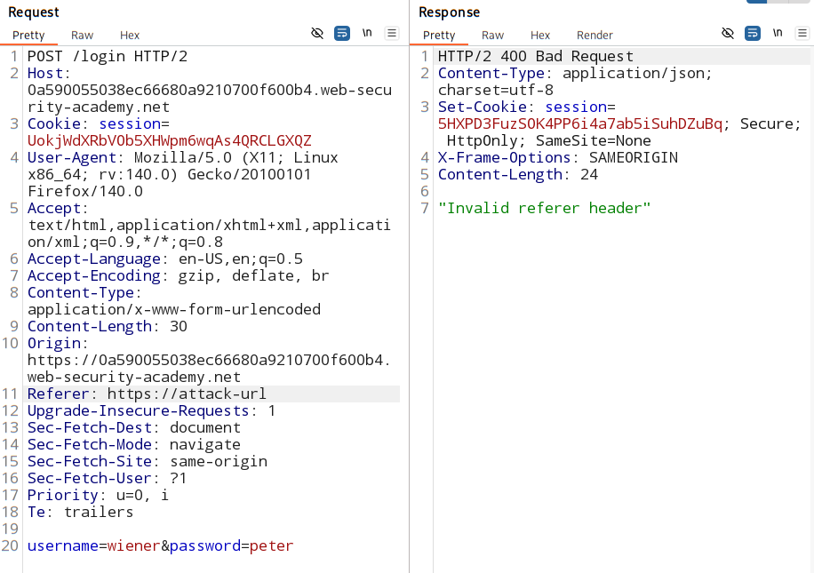
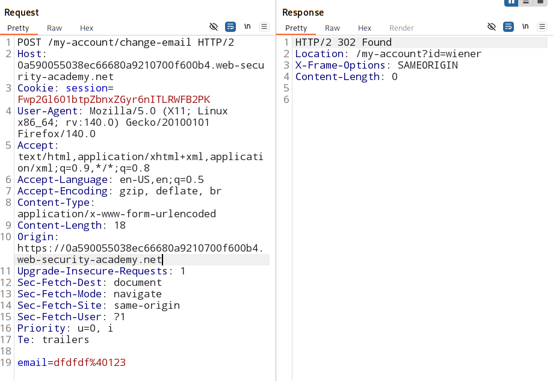

# CSRF where Referer validation depends on header being present

### [Refer lab](https://portswigger.net/web-security/learning-paths/csrf/csrf-validation-of-referer-depends-on-header-being-present/csrf/bypassing-referer-based-defenses/lab-referer-validation-depends-on-header-being-present)

### Vulnerable parameter:
- Email change functionality is vulnerable to CSRF.

### Goal: 
- CSRF attack using omit referer header from HTTP request

### Analysis:

#### email change from the same domain itself:
    

#### change the referer header to cross-domain:

- you get invalid referer header 

- why?

- server checks: 
    >  `referer-header` = `domain-name` 
    - not same - reject the request

### Test to referer header for CSRF attack:

1. remove refer header and see if we get a 302 Found response:

    

    - worked, bypassed.

### Attack script:

[click here](./PoCscript.html)