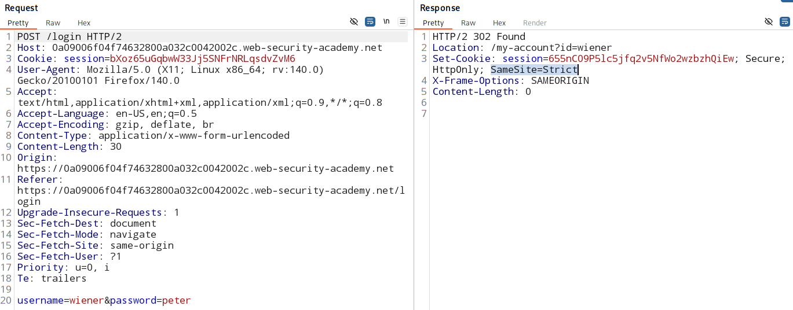
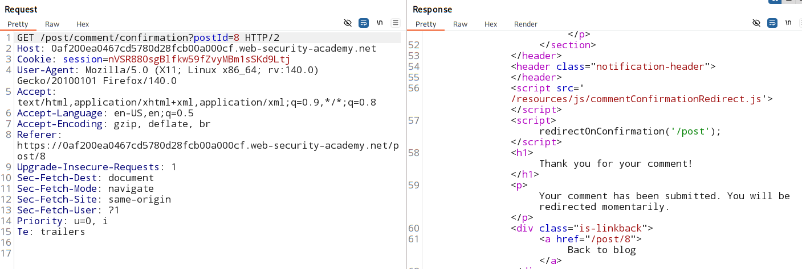

# SameSite=Strict bypass using `on-site Gadget`

### [vulnerable website](https://portswigger.net/web-security/learning-paths/csrf/csrf-bypassing-samesite-restrictions-using-on-site-gadgets/csrf/bypassing-samesite-restrictions/lab-samesite-strict-bypass-via-client-side-redirect#)

### Goal:
- Exploit the CSRF vulnerability

### Vulnerable parameter:
- Email change functionality.

### Analysis:

- This vulnerable website is using `sameSite=strict` with the session cookie.

- hence, can't send session cookie in cross site request.

- This doesn't contain any unpredictable tokens.

- May be vulnerable to CSRF if you can bypass any SameSite cookie restrictions. 

#### Checks:

1. Check `login` functionality's request for set-cookies attributes (SameSite, httpOnly, secure)

2. check if email change functionality accept `GET` request (it should accept it)

    - useful when we get a `client side redirect` (gadget) (which in nature is `GET` request) where we can control the input to that redirect 

    - we can send a `GET` email-change request

#### identify the suitable gadget:
- think where a website can apply redirect functionaliity 
    - after succesful login
    - after registring an account
    - after posting a comment

#### attack:

1. redirection after posting comment request and response:

    

    > /post/comment/confirmation?postId=8

    - attack paylaod can be included with this as value of `postId` 

    - **payload :**
        > /post/comment/confirmation?postId=../my-account/change-email?email=test1@tester.com%26submit=1

    - same site request triggred 

    - cookie passed

    - email changed

