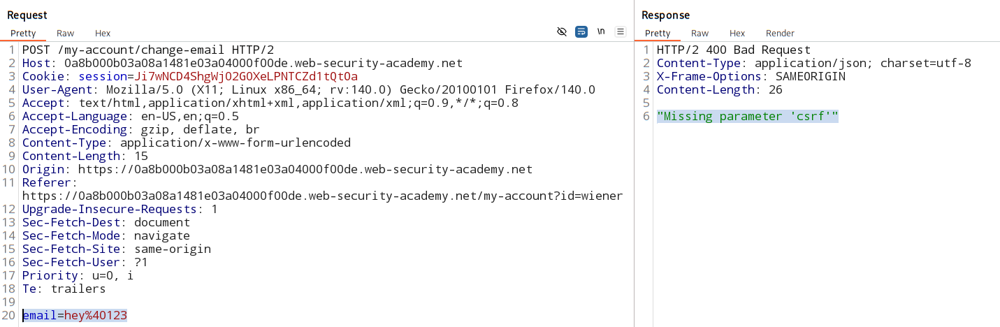
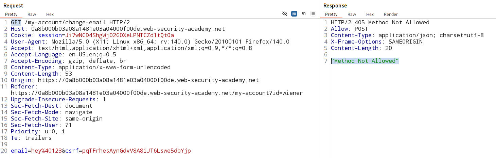
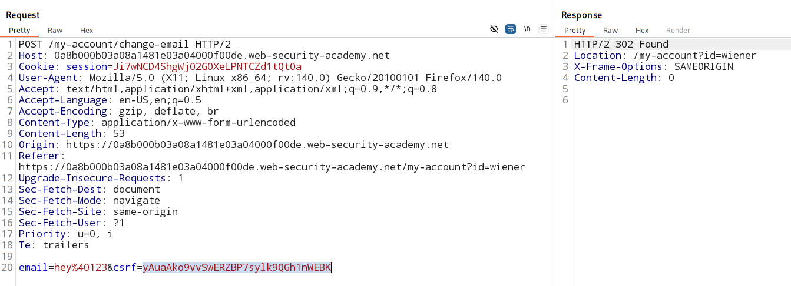

# CSRF where token is not tied to user session

### [vulnerable website](https://portswigger.net/web-security/learning-paths/csrf/csrf-common-flaws-in-csrf-token-validation/csrf/bypassing-token-validation/lab-token-not-tied-to-user-session)

### Vulnerable parameter:
Email change functionalilty.

### Goal:

#### Exploit the CSRF vulnerabilty:
1. generate a CSRF attack script (exploit).
    - remember user session is not tied to the CSRF token.

2. deploy the exploit on attackers application
    - spun a server .
    - host the exploit script on the server.
    - phish user to run the CSRF attack exploit (URL).

### Analysis:

#### is CSRF attack possible?

1. A relevent attack? -> **YES**

2. cookie based session handling? -> **YES**

3. any unpredectable request parameter? -> **YES**
    - but, 
    - this unoredectable parameter - CSRF token - is not tied to the user session
    - hence can be altered.

### Step wise checks for token validation: 

1. remove the CSRF token parameter from the request and check if app still works

    

2. Change request method from `POST` to `GET` anc check if app still works.

    

3. **Check if CSRF token is tied to the users session.**
    - access another account in the app 
    - or access the sign up functionalilty
    - and retrive the new CSRF token 
    - this new CSRF token will also be added into the pool of the apps CSRF token 
    - check the vicitm session be exploted with the new CSRF token.
    - **if YES, CSRF attack done - email change functionailty effected.**
    - else, CSRF attack not possible as session is chained to the CSRF token.

    

### CSRF script

[click here](./pocScript.html)