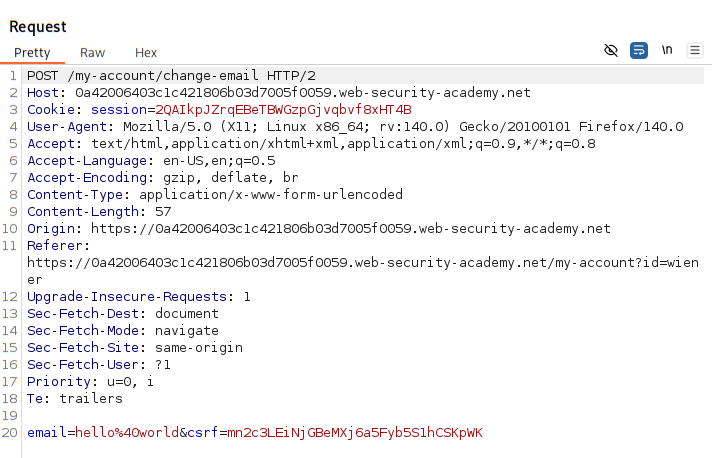
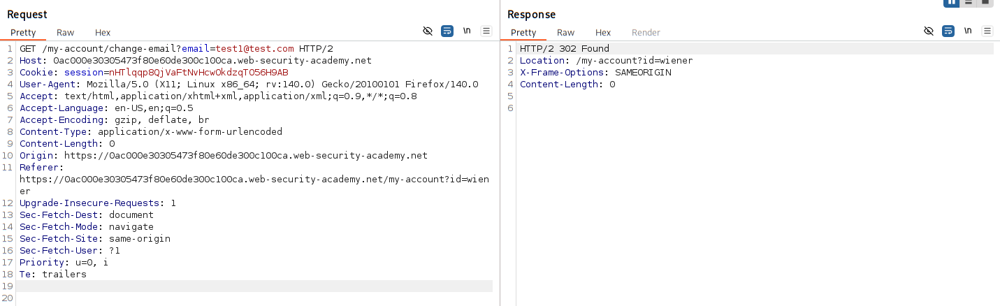

# CSRF token validation dependent on Request method

### [vulneable website link](https://portswigger.net/web-security/learning-paths/csrf/csrf-common-flaws-in-csrf-token-validation/csrf/bypassing-token-validation/lab-token-validation-depends-on-request-method#)

### vulnerable parameter:
email change functionality


### actions:
#### exploit the CSRF vulerability
1. built an HTML page using CSRF attack - change the email-address
2. Upload it to ur exploit server

### credentials: 
wiener:peter

### Analysis:

#### Is email change prone to CSRF attack? 


#### 1. is the functionality using cookie based session handling? -> YES

#### 2. Do email change functionailty has a relevant action ? -> YES

- Can change the users name and later change the password and have the control of the victims account.

#### presence of unpredictable parameter in the request ? -> YES
- in `POST` method request parameter - CSRF token is attachted.

- but there is a catch 

    - **CSRF token is not being attachted to `GET` method request parameter**

### Hence, we can use `GET` method to bypass the CSRF validation.



### Testing CSRF tokens validation:

1. Change the request method from `POST` to `GET`.
    - this works as sometime the dev only implement CSRF token on `POST` 
    - leaves `GET` method untouched - CSRF not implemented.
        - why?
        - coz usually get method is only used to read the data and it cant write anything to the application.
        - but...
        - **what if the app allow to send get request and write to application?**


### How the script runs ?
1. spun up an python server on local host

    - generate a self-signed certifcate in same directory as the files you want to serve:
        > openssl req -new -x509 -keyout key.pem -out cert.pem -days 365 -nodes

    - create a python HTTPs server script:
        ```
        import http.server
        import ssl

        server_address = ('0.0.0.0', 4443)

        httpd = http.server.HTTPServer(server_address, http.server.SimpleHTTPRequestHandler)

        context = ssl.SSLContext(ssl.PROTOCOL_TLS_SERVER)
        context.load_cert_chain(certfile="cert.pem", keyfile="key.pem")

        httpd.socket = context.wrap_socket(httpd.socket, server_side=True)

        print("HTTPS server running on https://localhost:4443")

        httpd.serve_forever()
        ```

        save as `https_serve.py` in any directory.

    - run the server
        > python3 https_server.py

    - access it in browser
        > https://localhost:4443