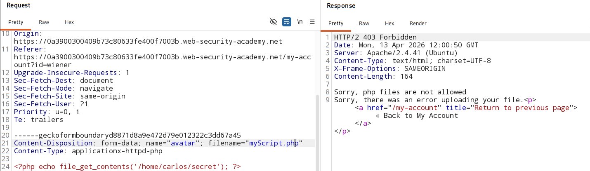
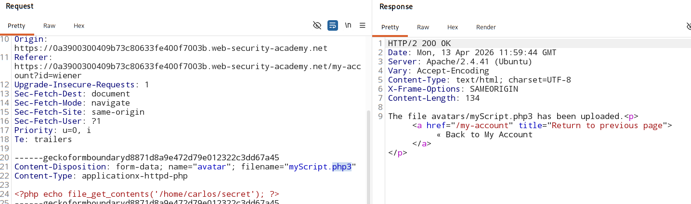
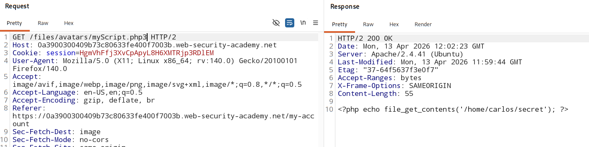
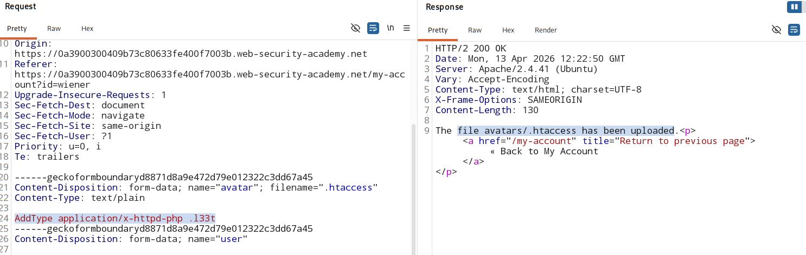
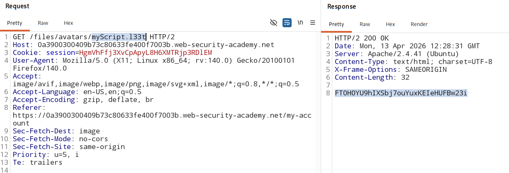

# Web shell upload via extension blacklist bypass

### [Vulnerable Webiste](https://portswigger.net/web-security/learning-paths/file-upload-vulnerabilities/insufficient-blacklisting-of-dangerous-file-types/file-upload/lab-file-upload-web-shell-upload-via-extension-blacklist-bypass)

## Vulnerable Parameter:
- **Image upload functionlity of change avatar.**

## Analysis:
- Certain file extensions are blacklisted.

- This defense can be bypassed
    - A fundamental flaw in the configuration of this blacklist. 

- To bypass the defence :
    - upload `php` config file in the directory of the server that is user-supplied.

        - `Content-Type : text/plain`
        - filename parameter = `.htaccess`
        - content (apche directive) :
            ```
            AddType application/x-httpd-php .php3
            ```
            - This maps an arbitrary extension (.php3) to the executable MIME type application/x-httpd-php

## PoC:

1. Change file name

    

2. Change `Content-Type`

    

3. Check if the content can be changed:

    


4. Check if `.php` file type is acceptable:

    
    
5. Check if any alternate `.php` is allowed:

    

    - `.php3` is is no blacklisted

    - but it wont run as the directory is not executable yet.

    - we will have to make the directory executable.

6. check if file is getting executed:

    

7. Make directory executable - upload config file on the directory:

    

8. Upload the malicious script: 

    Uploaded.png)

9. Execute the file - fetach sensitive data:

    