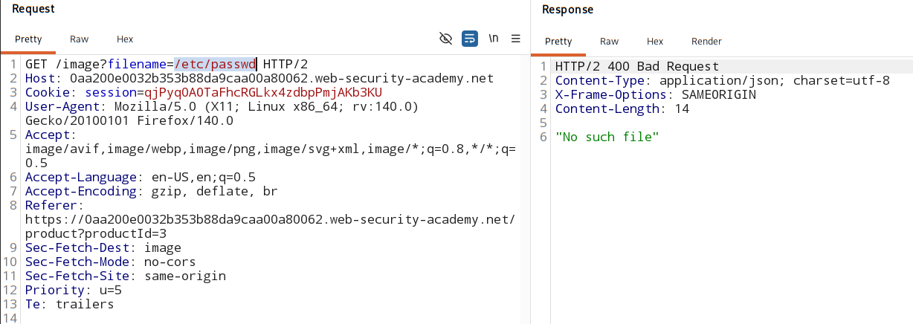

# File path traversal, simple case

### [vulnerable Website](https://portswigger.net/web-security/learning-paths/path-traversal/reading-arbitrary-files-via-path-traversal/file-path-traversal/lab-simple#)

## Vulnerable Parameter:
Path traversal vulnerability in the display of product images.  

## Analysis:

### Remember:

- Applications can only read the content of the file that is allowed to it. **(Privilages of tha application)**

    - Usually application are **NOT** run with `root privilages`

    - Privilage for applicaitons are kept very limited.

- **`/etc/passwd`** - world readable - any application with any level of privilage can read this file.

- Attackers use `/etc/passwd` to:
    - Confirm directory traversal works
    - Identify valid users on system
    - Gather info for further attacks

## Perform attack:

1. **Check if the file path accept absolute paths**

    

    - not accepting absolute paths
    - app is validating 'start of path'
    - file location in the server might be - `var/www/image/2.jpeg

2. **Modify the path travesal sequencer `../` and send.**

    