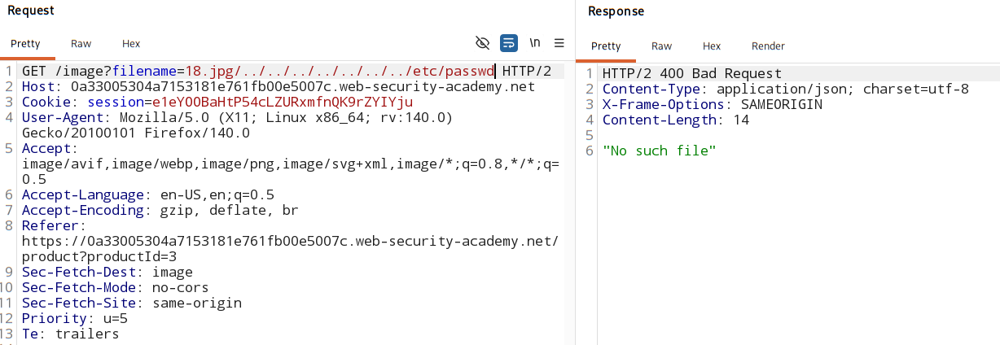
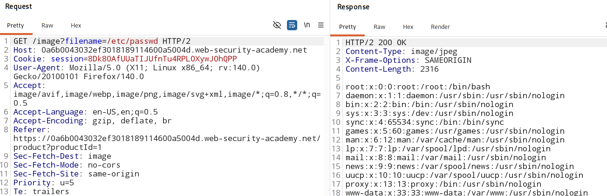

#  File path traversal, traversal sequences blocked with absolute path bypass

### [vulnerable website](https://portswigger.net/web-security/learning-paths/path-traversal/common-obstacles-to-exploiting-path-traversal-vulnerabilities/file-path-traversal/lab-absolute-path-bypass)

## Vulnerable paramter:
- A path traversal vulnerability in the display of product images.

## Overview:

- Some app blocks traversal sequence `../` when user-suppied file path is allowed.
    > ../../etc/passwd 
    - this fails / rejected.

- The developer only filters relative traversal patterns.
    ```
    if "../" in input:
        block()
    ```
- ### it can be by passed with `absolute path` 

    - directly send:
        > **/etc/passwd**
        - This is an absolute path (starts from root /)

### Sample code for such weak verification:
```
file = request.GET["file"]

if "../" in file:
    return "blocked"

open("/var/www/images/" + file)
```

## Analysis:

1. check if the user-input file path accept directory sequencer `../`

    

2. Check if the user-input file path accept `absolute path`:

    

### Attack Script:
[click here](./script.py)