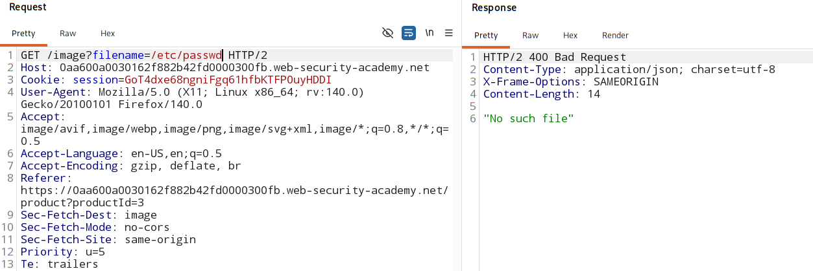
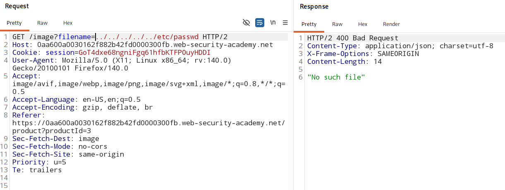
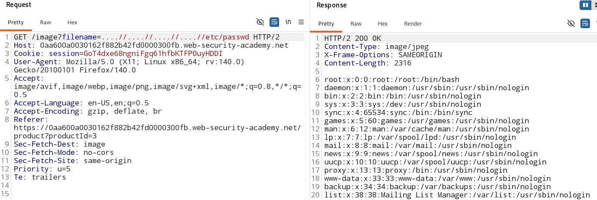

# File path traversal, traversal sequences stripped non-recursively

### [Vulnerable Website](https://portswigger.net/web-security/learning-paths/path-traversal/common-obstacles-to-exploiting-path-traversal-vulnerabilities/file-path-traversal/lab-sequences-stripped-non-recursively)

## Overview:

- The application tries to remove `../`, but does it incorrectly **(non-recursively)**.

- So attackers hide `../` inside a **larger pattern**, which becomes valid **after partial stripping**.

### Large pattern examples:

1. > ....//
    - App remove `../` once 
    - . . <mark> . . /</mark> / -> the highlighted part is removed 

2. > ....\\/
    - partial processing - `\/` -> `/`
    - then, `....//`
    - app remove `../` once 
    - finally - `../` is left and is a valid traversal 

### Attack Payload:

> ....//....//....//etc/passwd

> ....\\/....\\/....\\/etc/passwd

## Vulnerable parameter:

- Path traversal vulnerability in the display of product images. 

## Analysis:

1. Check if the user-input file path accept **absolute path**

    

2. Check if the user-input file path accept **directory sequences**

    

3. Check for **Non-recursive sanitization bypass**

    

### Attack Script

[Click here](./attackScript.py)
