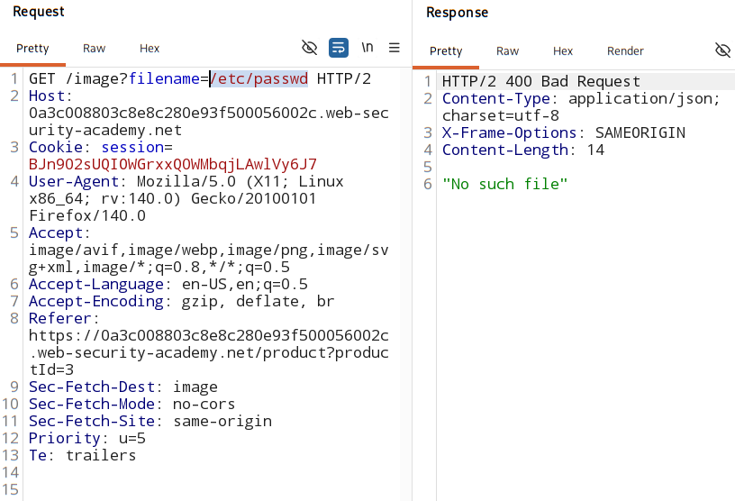
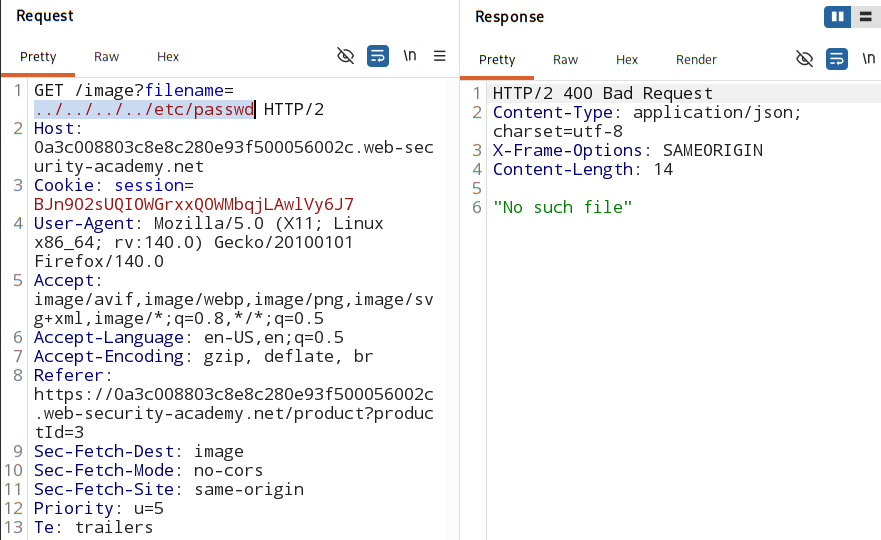
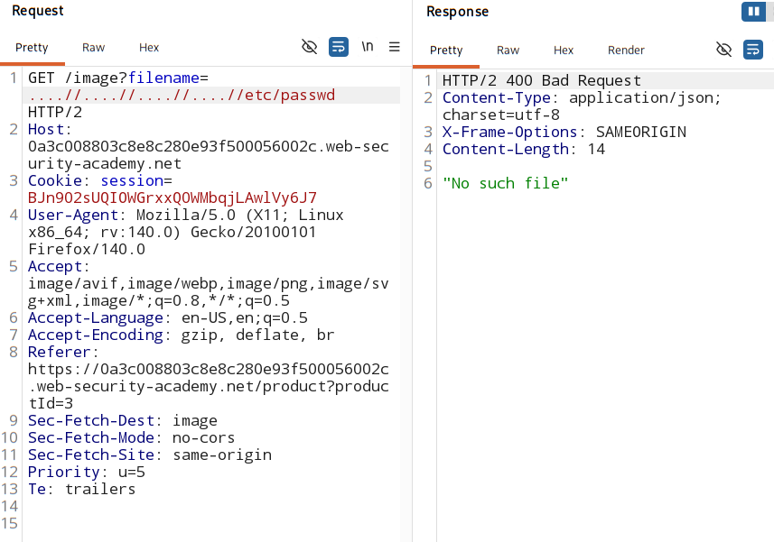
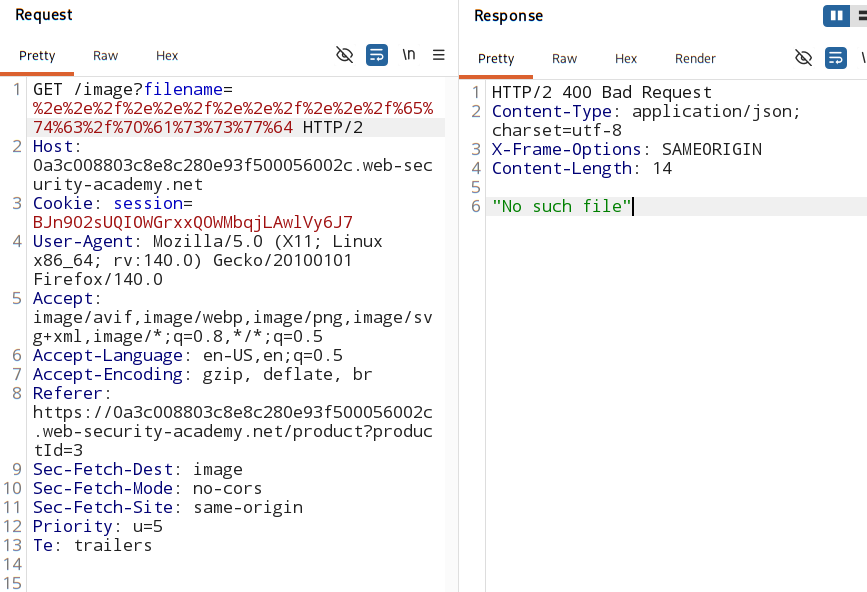
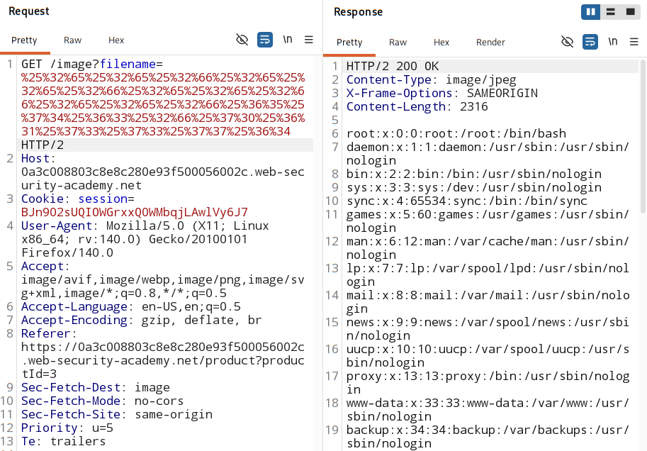

#  File path traversal, traversal sequences stripped with superfluous URL-decode

## Overview:

- Some web servers try to remove directory traversal seqeunces `../` before your input reaches the application.

- Mostly seen in apps with:
    - URL path
    - Filename parameter of a `miltipart/form-data` request

1.  But attackers can hide `../` using **encoding**

    - > ../
        - server detect this.

    - > %2e%2e%2f
        - server might not detect this though.
        - later decode it -> `../`

2. More powerful way: **double encoding**: 

    - used when server is decoding but only once
    - encode:
        > % → %25

    - So, 
        > %2e → %252e  
        > %2f → %252f

    - Final:
        > %252e%252e%252f

    - The server internally might just decode once and will see `%2e%2e%2f`

    - Double encoding **(superfluous decode)**
        > %252e%252e%252f

        - What happens:
            - First decode → %2e%2e%2f
            - Filter checks → doesn’t see .`./` ❌
            - Second decode → `../` 💥

3. Non-standard / Unicode encodings:

    > ..%c0%af  
    > ..%ef%bc%8f
    - These represent `/` using Unicode or overlong encoding

## Analysis:

1. Check if **absolute path** is allowed or not

    

2. Check if **directory traversal sequences** allowed or not

    

3. check if **Nested directory traversal** allowed or not

    

4. check if **Encoded directory traversal** allowed or not

    

    - not allowed - as the app first encode it and then filter any `../` found in the URL.

5. check if **double encoded directory traversal** allowed ot not

    