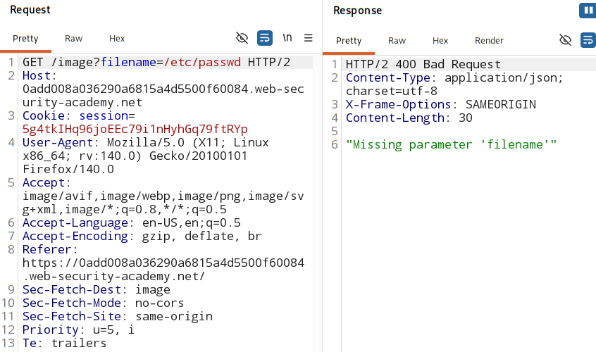
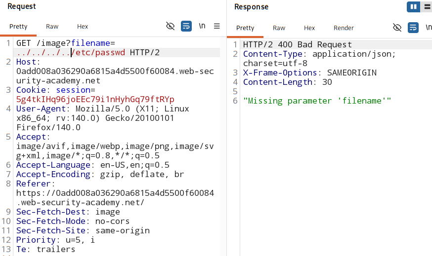
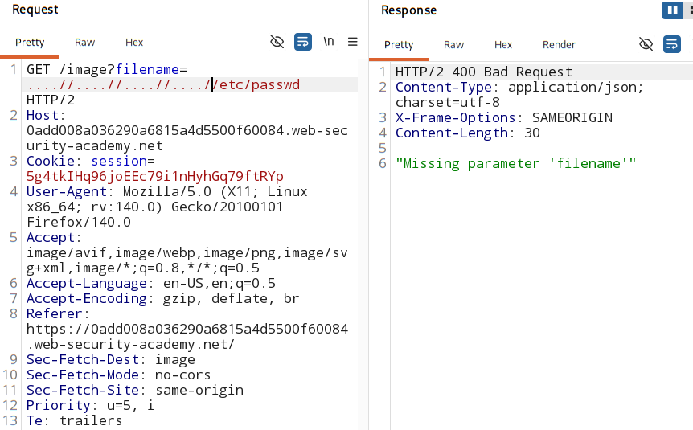
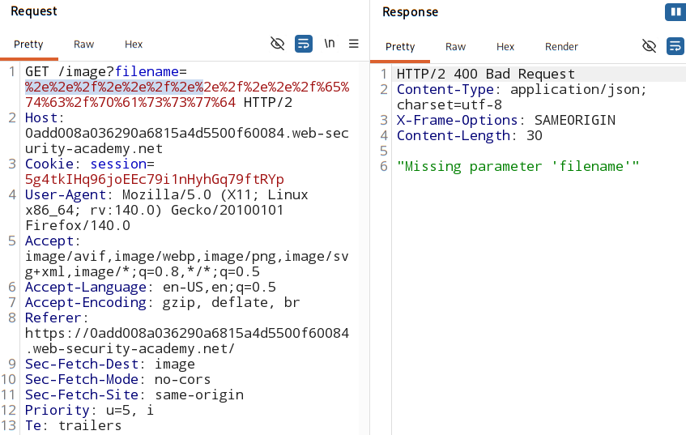
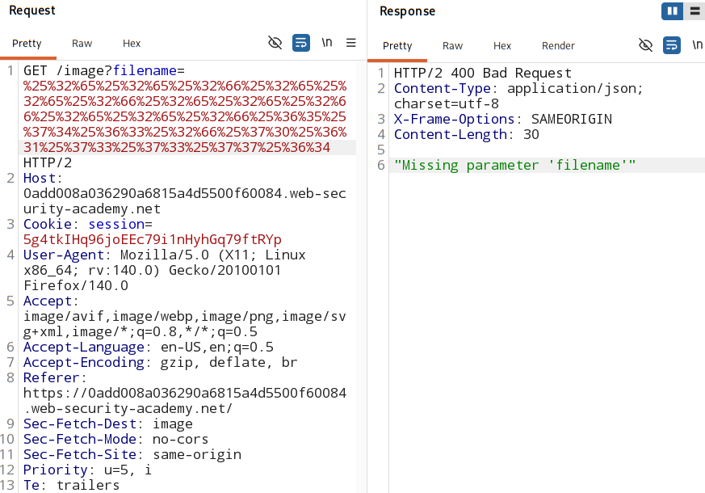
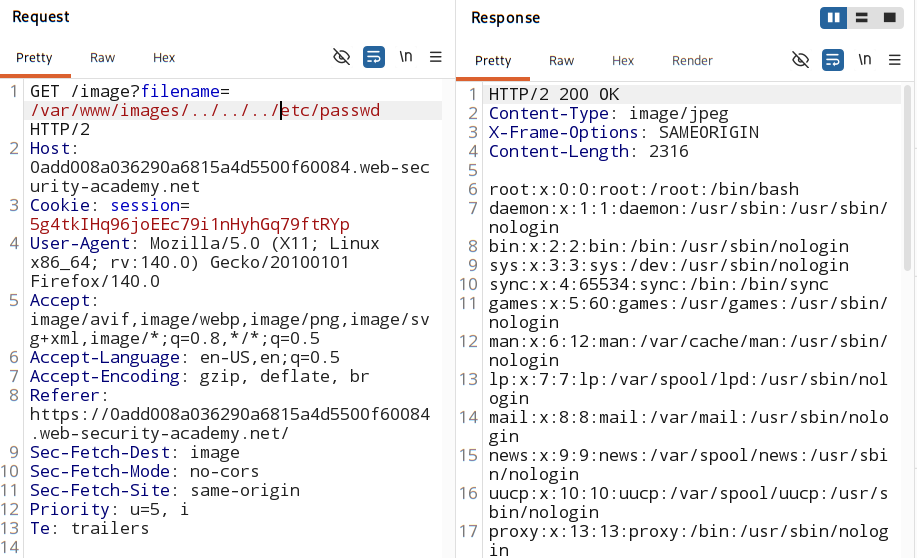

#  File path traversal, validation of start of path

### [Vulnerable parameter](https://portswigger.net/web-security/learning-paths/path-traversal/common-obstacles-to-exploiting-path-traversal-vulnerabilities/file-path-traversal/lab-validate-start-of-path)

## overview:
- An application may require the user-supplied filename to **start** with the **expected base folder**

- It is important in this case to add the base folder in the start always, else app will reject the file path tracersal.

- > **filename=/var/www/images/../../../etc/passwd**

## Analysis:

1. Check if the absolute path is allowed or not:

    

2. Check if the directory traversal sequence `../` is allowed or not:

    

3. Check if **Nested directory traversal** allowed or not

    

4. Check if **encoded directory traversal** allowed or not

    

5. Check if **double encoded directory traversal** allowed or not

    

6. Check if the filename **MUST start with the specifed path**:

    