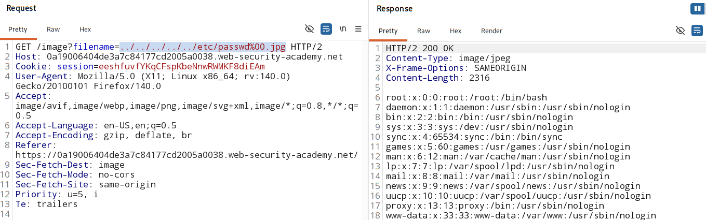

# File path traversal, validation of file extension with null byte bypass

### [Vulnerable website](https://portswigger.net/web-security/learning-paths/path-traversal/common-obstacles-to-exploiting-path-traversal-vulnerabilities/file-path-traversal/lab-validate-file-extension-null-byte-bypass)

## Overview:

- Some application makes it compulsory to mention `file extension` in the end of user-supplied filename.

- to **bypass** this logic - `null byte` can be used to effectively terminate the file path before the required extension.

### `%00` - NULL BYTE (`\x00`)

> ../../../etc/passwd   ❌ blocked  
> ../../../etc/passwd.png   ✅ allowed

### Example:
> ../../../etc/passwd%00.png
- app check extension - `.png` ✅
#### After system processes it: 
> ../../../etc/passwd\0.png
- system stops at `\0`

## Analysis:
1. Check if **absolute path** is accepted or not.

2. Check if **path traversal sequences** is accepted or not.

3. Check if **nested path traversal sequencer** is accepted or not

4. check if **encoded path** is accepted or not

5. check if **double encoded path** is accpeted or not.

6. Check if **start with path** is accepted or not.

7. Check if **Null byte extension** is accepted or not.

    