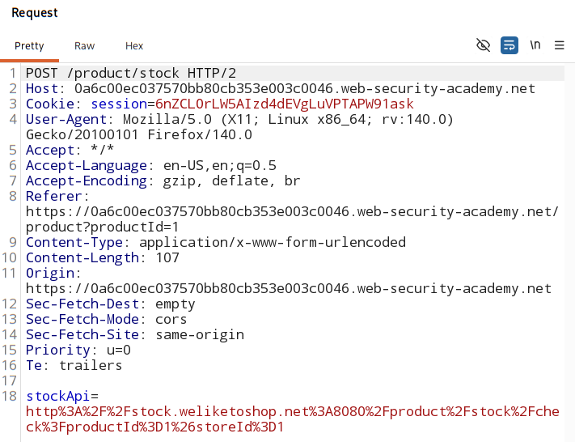
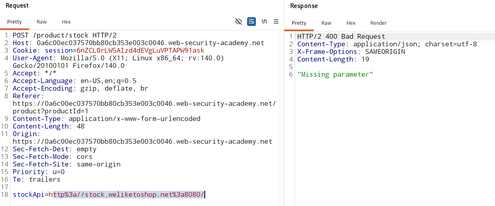
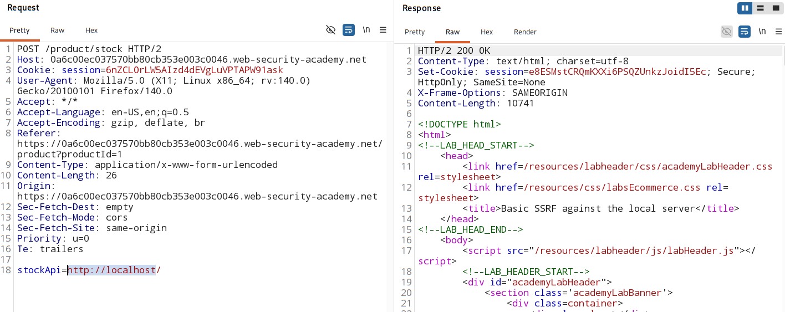
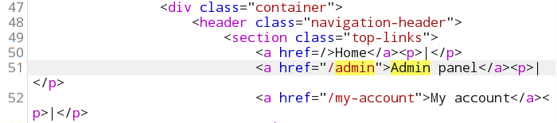
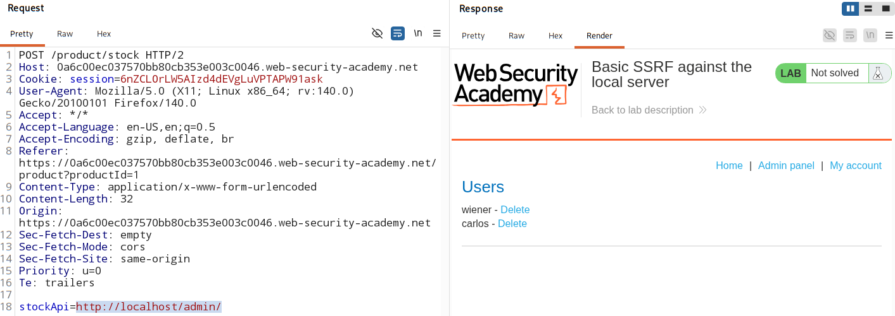
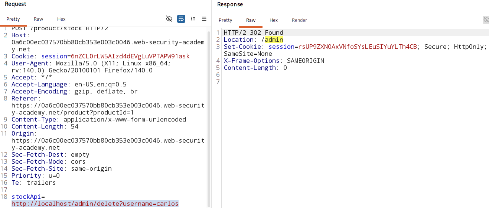

# Basic SSRF against the local server

### [Vulnerable Website](https://portswigger.net/web-security/learning-paths/ssrf-attacks/ssrf-attacks-common-ssrf-attacks/ssrf/lab-basic-ssrf-against-localhost)

## Vunerable feature

Stock check functionality in the application.

## Analysis

The `HTTP request` of `check stock` :
    

- `stockApi` is the URL for application that will be called when user will click `check stock`

-  Assuming this API is hosted in the internal server, we can check if this is SSRF vulnerbale and get access to privilaged data.

    1. check if the API can be reached (no parameter | only URL for the API) 

        

        - The URL can't be reached directly without specifying the path and parameter.

    2. check if `localhost` can be reached

        

        - `localhost` reached - **SSRF vulnerable functionalilty**
        - same application is also running on the localhost.
        - Has extra funcitonality of `admin panel` - control the application 
        - dont require authentication to access it.

        To reach `admin panel` the path used is `\path`

        

    3. Hit admin panel URL:

        

    4. Delete the user:

        > http://localhost/admin/delete?username=carlos

        

        - deleted user `carlos`.

## Attack Script

### [click here](./attack.py)