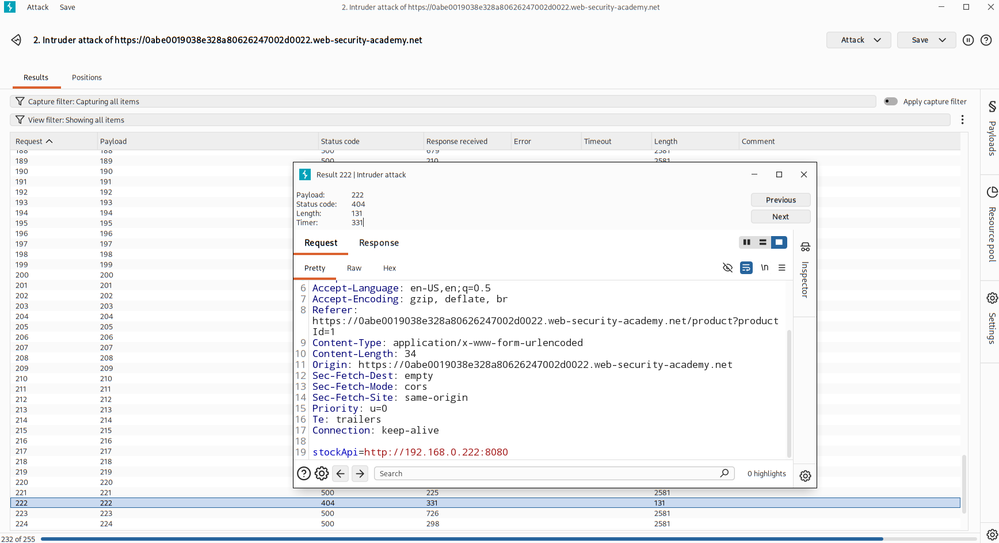
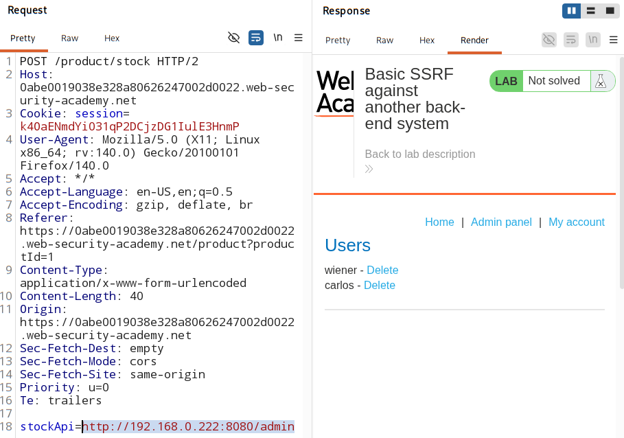

# SSRF attack against other back end systems

### [Vulnerable website](https://portswigger.net/web-security/learning-paths/ssrf-attacks/ssrf-attacks-common-ssrf-attacks/ssrf/lab-basic-ssrf-against-backend-system)

## Overview:

- Some application server (server on which application is hosted) can reach other `backend systems` without even being directly reachable by the user.

    > User ❌ → Internal API (blocked)  
    > Server ✅ → Internal API (allowed)

- Such server can be used by the attacker to access data of such `un-hidden` systems.

### Back-end systems?

- Systems that are **not** exposed to the public internet. 

- Often have **non-routable private IP addresses**.

- Example:
    - Internal APIs
    - Databases
    - Admin panels
    - Microservices

- **Non-routable pvt IP addresses range:**
    - `10.0.0.0/8`
    - `172.16.0.0/12`
    - `192.168.0.0/16`

- Dev impelement for such systems - **Weaker security posture**
    - No authentication 
    - Weak validation 
    - Hidden APIs exposed

## Analysis

1. Check if the API (main page) can be reached (no parameter | only URL for the API)
    - error = `missing parameter`

2. Check if there is any other application running on the IP range `192.168.0.0/24`
    
    - use `intruder`
    
    

    - app is also running on `192.168.0.222:8080`

    - status code - `404`
        - means we didnt find exact path that can be reached 
        - main page cant be reached directly or does not exit.

3. Try to access `admin panel` of this new app location.

    

4. Delete the user `carlos`.
    > http://192.168.0.222:8080/admin/delete?username=carlos

## Prevention

1. Implement authentication in internal systems.

2. Server should not be given unrestricted internal access.

3. SSRF protections :
    - URL validaiton
    - allow list

4. Network Segmentation :
    - Separate VPC / subnets
    - Firewalls / security groups
    - Microservices isolation
    - Zero trust model