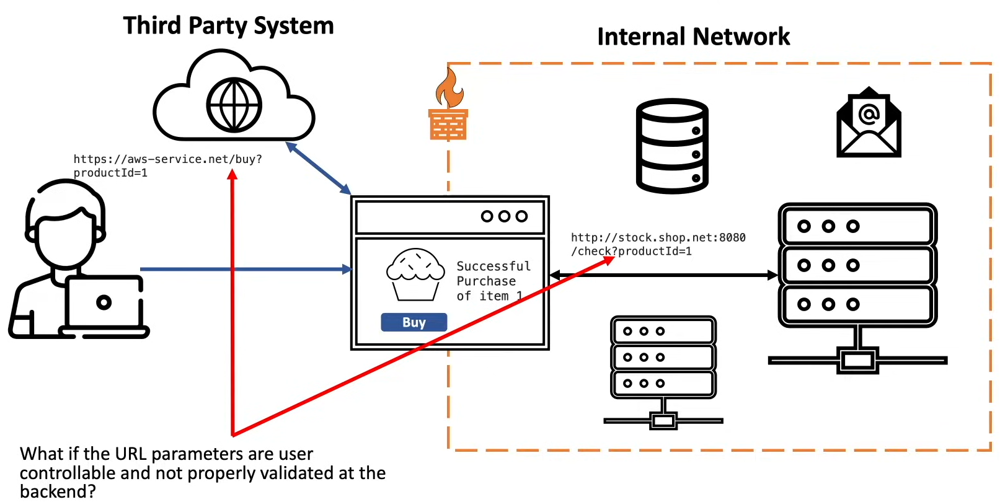
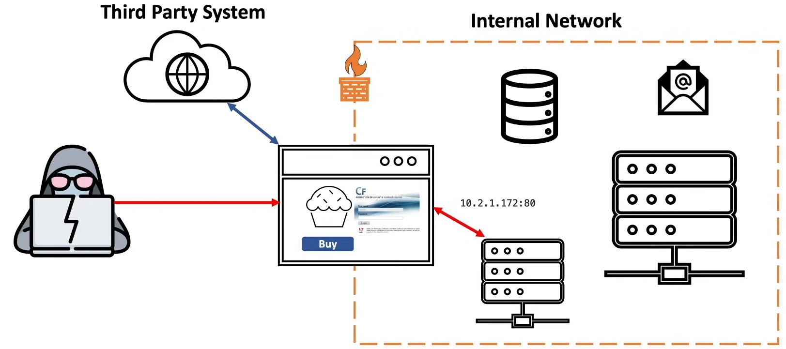
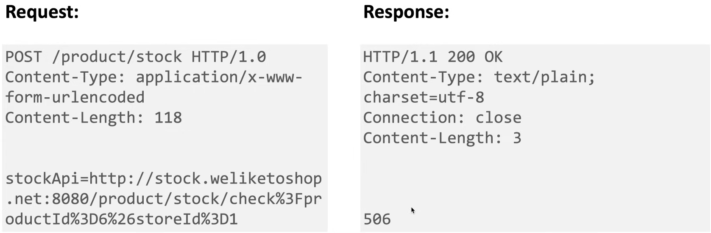
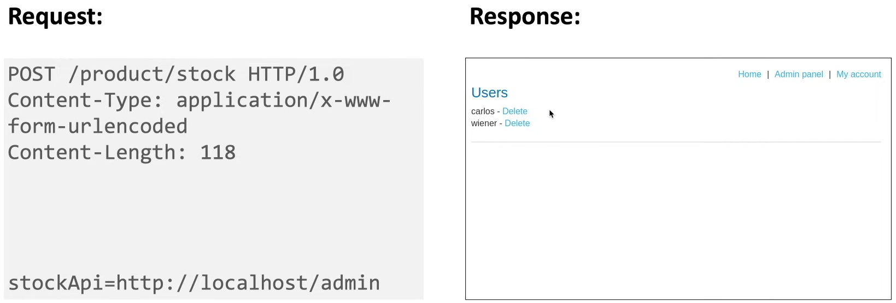

# SSRF - Server Side Request Forgery 

## What is SSRF?

- Server-side request forgery is a web security vulnerability that allows an attacker to cause the **server-side application to make requests to an unintended location**. 

- Occurs when an app is fetching a remote resource w/o first validating the user-supplied URL.

- attacker coerce the server into making network connections on behave of the attacker and potentially target system that are behind the firewall.

## blue teaming - watch out for:
- if logs show URL parameter request contaning :
    - IP address,
    - hostname,
    - or URL 
- test it for SSRF attack.

## Usage: 

### Expolit user supplied parameter:

- URL parameters are **user controllable** - can be changed by the client / user client side.

- **Not properly validated** - limited to no logic is being applied at the back end to block malicious payload.

    

### SSRF is also used for port scan of the network:

- SSRF vulnerabilty can be used to run an **automated attack** that scan the entire pvt. IP range for server that are running application.

- Which port is up.

- what services are running on the up ports.

- attacker can **access internal services**.
    - `localhost` | `127.0.0.1`

    - Private IPs (`10.0.0.0/8`, `172.16.0.0/12`, `192.168.0.0/16`)

    - that are not accessible via internet.

    

### Exploit SSRF vulnerabilty that are present in application running the cloud  

- use to steal `cloud metadata`.

- example:
    - app in AWS
    - > http://169.254.169.254/latest/meta-data/
    - attack get access of:
        - access keys
        - IAM roles
        - secrets

## Type of SSRF :

```
                       [SSRF]
                      /      \
    [Regular / In Band]       [Blind / Out-of-Band]
```

1. **Regular / In band :**
    - Attacker can tamper with the requested URL and the response to the requested URL can be displayed back to the attacker.

2. **Blind / out-of-band :**
    - Attacker can tamper wiht the requested URL and the response to the requested URL CAN NOT be displayed back to the attacker.

    - In order to prove that the vulnerabilty does really exist, attacker will force a `DNS` or `HTTP` request from  the victim app to attacker controlled server (eg - Burp colaborator).
        - If the attacker server **gets** the request - **SSRF present**.
        - If the attacker server **dont get** the request - **SSRF not present**

## How to find SSRF vulnerabilities:

### Black Box & Gray box POV:

1. Map the application:
    - Identify any request parameters or input vector that contain:
        1. hostnames,
        2. IP address,
        3. or full URLs  
            coz this means that these parameter are being used to communicating with external systems.

2. For **in-band SSRF** - Send SSRF payloads (modify the value to specify an **alternative resource**) to all these potential vulnerable parameters.  
    - If a defense is in place, attempt to circumvent it using known techniques.

3. For **blind SSRF**- modify the value to a server on the internet that you (attacker) control and monitor the server for incoming requests.
    - If no incoming connections are received, monitor the time taken for the applicaiton to respond.
        - Coz some times firewall block the connections.

### White Box POV:

1. Review the source code and identify all the request parameters that accepts URLs.
    - check the logic for a functionality that talk to the backend and see if any code for SSRF defence is applied or not.

    - If **black list** - easy to bypass

    - for **White list** - check what `URL parser` is being used and if it can be bypassed.

## How to exploit SSRF vulnerabilities:

### Exploting Regular / in-band SSRF:

- **very basic Example :** 

    - <u>Check the stock</u>:

        

        - stockApi = contains the URL of the app that is responsible for checking the stock

    - <u>Attack payload</u> :

        

 - ### When app allow for user-supplied arbitrary URLs:

    - Requesting `any URL` is allowed 

    - **Attack:**

        1. Determine if `port number` can be specified.

        2. if yes, `port scan` the internal network using `burp intruder`
            - Look for other application internally that can give us access to sensitive functionality. 

        3. Attempt to connect to other services on the `loopback address`. (above in the example)

- ### When app dont allow for arbitrary user-suppilied URLs:
    
    - Bypass defenses using following technique:

        1. **Use different encoding schemes**
            - Usually used to bypass `blacklist`.
            - Example:
                - if app black list internal IP (127.0.0.1)
                - **Decimal-encode** 127.0.0.1 = `2130706433`.
                - use `127.1` instead of 127.0.0.1
                - use **octal representation** of local host - `017700000001`.

        2. **DNS rebind attack**
            - some app uses liberies (not blacklisting) to disallow the calling of pvt. IP URLs.
            - prevent attacker from port scanning internal network.
            - bypass this using **DNS rebind attack**.
                - attacker register a domain name that resolve to Internal IP address.
                - A website you visit changes its IP address after your browser trusts it, so it can start talking to internal systems (like 127.0.0.1 or LAN devices). 
        
        3. **HTTP redirection bypass**
            - attacker use a URL that points to a server that attacker controls (server has a public Ip address)
            - Once the URL is visited by the victim machine, it redirect to internal IP address.

        4. **Exploit inconsistancies in URL parsing.**

### Exploting Blind / out-of-band SSRF:

#### Techniques:

1. **No defence** in place to prevent SSRF:
    - Attempt to trigger an `HTTP / DNS request` to an external server that you(attacker) control and monitor the external server for any network connections

2. If **defences** put in place to prevent SSRF:
    - **Obfuscate** the external malicious domain (mentioned in 'exploting regular SSRF')

## Finding hidden attak surface for SSRF:

- Many SSRF vulnerabilites are easy to find
    - application normal network traffic contain request that have have parameter containing the URLs.

- ### Harder to find ones SSRFs:

    1. #### Partial URLs in requests:
        - Sometimes, an application places only a hostname or part of a URL path into request parameters.
        
        - The value submitted is then incorporated server-side into a full URL that is requested.

        - attacker have control over **only a part** of the URL.

    2. #### URLs within data formats:
        - Some data formats (like XML, JSON, PDF, etc.) have features where:
            - You include a URL inside the data
            - The server-side parser automatically fetches it

        - That fetch = SSRF

        - When an application accepts data in XML format and parses it, it might be vulnerable to `XXE injection`. It might also be vulnerable to `SSRF via XXE`. 

        - example: (SSRF via XXE)
            ```
            <!DOCTYPE foo [
                <!ENTITY xxe SYSTEM "http://attacker.com">
            ]>
            <data>&xxe;</data>
            ```
        - fomate that cause this:

            1. **XML**

            2. **SVG** (it is also XML based)       
                > \<image href="http://attacker.com/image.png"/>
                - server process it - request triggered

            3. **PDF generator**
                - Some apps convert HTML → PDF

                    > \
                    - PDF engine fetch image -> SSRF

            4. **JSON-based integrations**
                ```
                {  
                    "webhook": "http://attacker.com"  
                }
                ```
                - Server may call webhook automatically

            5. **YAML / config files**:
                > url: http://attacker.com
                - Some parsers fetch remote content

    3. **SSRF via referer header**:
        - Some applications use server-side analytics software to tracks visitors. 
        
        - This software often logs the Referer header in requests, so it can track incoming links. 

        - hence referer header is used to for SSRF attack.
            - the analystics s/w will visit the referer header and payload will execute the attack.
            
            - example : change,

                > Referer: https://siteA.com

            - to,

                > Referer: http://localhost/admin

## How to prevent SSRF vulnerabilities:

1. **Defence indepth approch :** 
    1. Application layer defences
    2. Network layer defences

    - **Application layer defences:**

        - Sanitize and validate all client suppied-input data.

        - whitelist:
            - URL schemes
            - ports
            - destination IPs / hosts

        - **Dont** sent raw response to the client.

        - Disable HTTP redirections

        > **Never mitigate SSRF vulnerabilties using `deny list` (blacklist) or regular expression**

    - **Network layer defences :**
        - Segment remote/external resource access functionality in separate networks to reduce the impact of SSRF

        - Enforce `deny-by-default` firewall policy. 